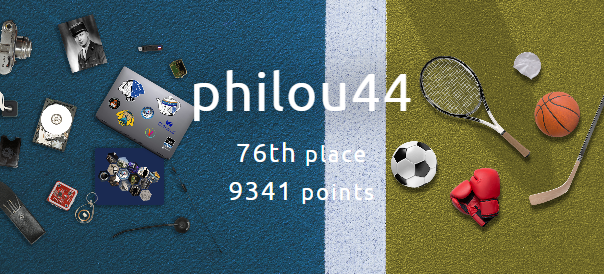

# 404CTF-2024-writeup

Voici les réflexions menées pour résoudre certains des challenges proposés lors du [404CTF 2024](https://ctf.404ctf.fr/). 
Le CTF s'est déroulé du 20 avril au 12 mai 2024 en ligne et a réuni 3271 compétiteurs.

## Résultat obtenu

<table>
  <tbody>
    <tr>
      <td></td>
      <td></td>
    </tr>
  </tbody>
</table>

## Challenges résolus

<table>
 <thead><tr><th>Catégorie</th><th>Challenge</th><th>Niveau</th><th>Points obtenus</th><th>Résolutions</th></tr></thead>
 <tbody>
  <tr><td rowspan=1>Algorithmique quantique</td>
        <td><a href="./quantum/des-trains-superposes/des-trains-superposes.md">Des trains superposés</a></td><td style="color:skyblue">Intro</td><td>100</td><td>118</td></tr>

  <tr><td rowspan=7>Cryptanalyse</td>
        <td><a href="./crypto/bebe-nageur/bebe-nageur.md">Bébé nageur</a></td><td style="color:skyblue">Intro</td><td>100</td><td>1152</td></tr>
    <tr><td><a href="./crypto/le-petit-bain/le-petit-bain.md">Le petit bain</a></td><td style="color:lime">Facile</td><td>200</td><td>254</td></tr>
    <tr><td><a href="./crypto/poor-random-number-generator-1_2/poor-random-number-generator-1_2.md">Poor Random Number Generator [1/2]</a></td><td style="color:lime">Facile</td><td>271</td><td>192</td></tr>
    <tr><td><a href="./crypto/plongeon-rapide-super-artistique/plongeon-rapide-super-artistique.md">Plongeon Rapide Super Artistique</a></td><td style="color:orange">Moyen</td><td>698</td><td>124</td></tr>
    <tr><td><a href="./crypto/j-eponge-donc-j-essuie/j-eponge-donc-j-essuie.md">J'éponge donc j'essuie</a></td><td style="color:orange">Moyen</td><td>891</td><td>75</td></tr>
    <tr><td><a href="./crypto/zack-adeaux/zack-adeaux.md">Zack Adeaux</a></td><td style="color:orange">Moyen</td><td>967</td><td>42</td></tr>
    <tr><td><a href="./crypto/la-seine/la-seine.md">La Seine</a></td><td style="color:red">Difficile</td><td>968</td><td>41</td></tr>

  <tr><td rowspan=3>Divers</td>
        <td><a href="./misc/discord/discord.md">Discord</a></td><td style="color:skyblue">Intro</td><td>10</td><td>1264</td></tr>
    <tr><td><a href="./misc/de-la-friture-sur-la-ligne/de-la-friture-sur-la-ligne.md">De la friture sur la ligne</a></td><td style="color:skyblue">Intro</td><td>100</td><td>348</td></tr>
    <tr><td><a href="./misc/bienvenue/bienvenue.md">Bienvenue</a></td><td style="color:skyblue">Intro</td><td>100</td><td>3271</td></tr>

  <tr><td rowspan=2>Exploitation de binaires</td>
        <td><a href="./pwn/pseudoverflow/pseudoverflow.md">Pseudoverflow</a></td><td style="color:skyblue">Intro</td><td>100</td><td>357</td></tr>
    <tr><td><a href="./pwn/jean-pile/jean-pile.md">Jean Pile</a></td><td style="color:lime">Facile</td><td>820</td><td>96</td></tr>

  <tr><td rowspan=2>Intelligence artificielle</td>
        <td><a href="./ai/du-poison-1_2/du-poison-1_2.md">Du poison [1/2]</a></td><td style="color:skyblue">Intro</td><td>100</td><td>215</td></tr>
    <tr><td><a href="./ai/du-poison-2_2/du-poison-2_2.md">Du poison [2/2]</a></td><td style="color:lime">Facile</td><td>352</td><td>181</td></tr>

  <tr><td rowspan=4>Investigation numérique</td>
        <td><a href="./forensics/le-tir-aux-logs/le-tir-aux-logs.md">Le tir aux logs</a></td><td style="color:skyblue">Intro</td><td>100</td><td>1116</td></tr>
    <tr><td><a href="./forensics/un-boulevard-pour-pointer/un-boulevard-pour-pointer.md">Un boulevard pour pointer</a></td><td style="color:skyblue">Intro</td><td>100</td><td>127</td></tr>
    <tr><td><a href="./forensics/coup-de-circuit-1_3/coup-de-circuit-1_3.md">Coup de circuit [1/3]</a></td><td style="color:lime">Facile</td><td>200</td><td>291</td></tr>
    <tr><td><a href="./forensics/darts-bank/darts-bank.md">Darts Bank</a></td><td style="color:orange">Moyen</td><td>200</td><td>245</td></tr>

  <tr><td rowspan=3>Renseignement en sources ouvertes</td>
        <td><a href="./osint/legende/legende.md">Légende</a></td><td style="color:skyblue">Intro</td><td>100</td><td>1590</td></tr>
    <tr><td><a href="./osint/not-on-my-watch/not-on-my-watch.md">Not on my watch</a></td><td style="color:lime">Facile</td><td>200</td><td>1423</td></tr>
    <tr><td><a href="./osint/coup-de-circuit-2_3/coup-de-circuit-2_3.md">Coup de circuit [2/3]</a></td><td style="color:lime">Facile</td><td>200</td><td>224</td></tr>

  <tr><td rowspan=4>Rétro-Ingénierie</td>
        <td><a href="./reverse/echauffement/echauffement.md">Échauffement</a></td><td style="color:skyblue">Intro</td><td>100</td><td>524</td></tr>
    <tr><td><a href="./reverse/intronisation-en-chaussure/intronisation-en-chaussure.md">Intronisation du CHAUSSURE</a></td><td style="color:lime">Facile</td><td>200</td><td>527</td></tr>
    <tr><td><a href="./reverse/bugdroid-fight-1_2/bugdroid-fight-1_2.md">Bugdroid Fight [1/2]</a></td><td style="color:lime">Facile</td><td>200</td><td>294</td></tr>
    <tr><td><a href="./reverse/bugdroid-fight-2_2/bugdroid-fight-2_2.md">Bugdroid Fight [2/2]</a></td><td style="color:orange">Moyen</td><td>776</td><td>107</td></tr>

  <tr><td rowspan=2>Sécurité matérielle</td>
        <td><a href="./hardware/serial-killer/serial-killer.md">Serial killer</a></td><td style="color:skyblue">Intro</td><td>100</td><td>181</td></tr>
    <tr><td><a href="./hardware/le-souleve-de-gnd/le-souleve-de-gnd.md">Le soulevé de GND</a></td><td style="color:lime">Facile</td><td>388</td><td>176</td></tr>

  <tr><td rowspan=2>Stéganographie</td>
        <td><a href="./stegano/l-absence/l-absence.md">L'absence</a></td><td style="color:skyblue">Intro</td><td>100</td><td>1638</td></tr>
    <tr><td><a href="./stegano/regarder-en-stereo/regarder-en-stereo.md">Regarder en stéréo</a></td><td style="color:lime">Facile</td><td>200</td><td>692</td></tr>

  <tr><td rowspan=3>Web</td>
        <td><a href="./web/vous-etes-en-retard/vous-etes-en-retard.md">Vous êtes en RETARD</a></td><td style="color:skyblue">Intro</td><td>100</td><td>1853</td></tr>
    <tr><td><a href="./web/le-match-du-siecle-1_2/le-match-du-siecle-1_2.md">Le match du siècle [1/2]</a></td><td style="color:skyblue">Intro</td><td>100</td><td>1419</td></tr>
    <tr><td><a href="./web/le-match-du-siecle-2_2/le-match-du-siecle-2_2.md">Le match du siècle [2/2]</a></td><td style="color:orange">Moyen</td><td>200</td><td>708</td></tr>

 </tbody>
</table>
