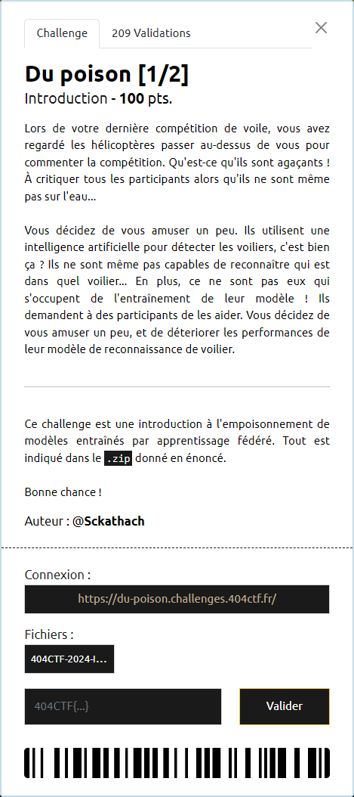

# Du poison [1/2]



----

Le modèle dont on dispose vise à effectuer la reconnaissance de chiffres (de 0 à 9) écrits manuellement.

Pour cela on dispose :
- d'images sur lesquelles des chiffres ont été écrits à la main 
- et associé à chacune de ces images, de la valeur du chiffre correspondant. Cette valeur est représentée sous la forme d'un tableau de 10 Boolean. L'index du tableau valorisé à `True` correspond à la valeur du chiffre représenté sur l'image. Les autres index sont tous valorisés à `False`.

Ainsi, la valeur `1` est représentée comme suit : `[False True False False False False False False False False]`.

Ce qui est demandé c'est d'empoisonner le modèle au maximum, de sorte que la précision de la reconnaissance soit la plus faible possible.

Pour cela, il suffit de falsifier toutes les données utilisées pour entrainer le modèle.

On choisit d'inverser toutes les valeurs du tableau représentant la valeur de l'image, pour toutes les données utilisées lors de l'entrainement du modèle.

Ainsi, la valeur `1` sera représentée, après empoisonnement, par `[True False True True True True True True True True]` :

```py
# Empoisonnement des données utilisées pour entrainer le modèle
for idx,val in enumerate(y_train):
    y_train[idx] ^= True

# Entrainement du modèle
local_results = train_and_test(
    model_base, 
    x_train,
    y_train, 
    x_test, 
    y_test, 
    epochs=local_epochs
)
```

La soumission des poids correspondant à l'entrainement du modèle avec ces données, permet de récupérer le flag `404CTF{0h___dU_P01sON}`
