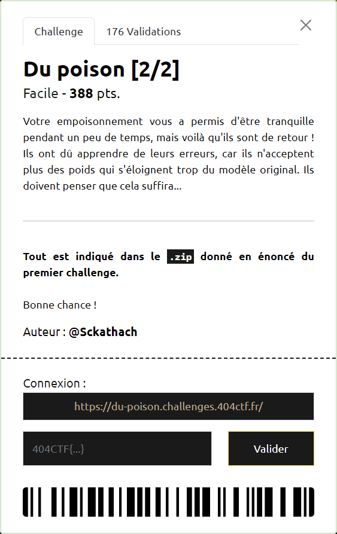

# Du poison [2/2]



----

On utilise la même technique que lors de la 1ère étape [Du poison [1/2]](../du-poison-1_2/du-poison-1_2.md)

Sauf qu'on va réaliser l'empoisonnement sur uniquement 10% des données utilisées pour l'entrainement du modèle :

```py
model = NN()
model.load_weights("weights/base_fl.weights.h5")
local_epochs = 5
nb_clients = 5

x_train, y_train, x_test, y_test = load_mnist()
x_clients, y_clients = data_to_client(x_train, y_train, nb_clients=nb_clients)

# Empoisonnement des données utilisées pour entrainer le modèle
for idx,val in enumerate(y_train):
    if idx % 10 == 0:
        y_train[idx] ^= True

# Entrainement du modèle
local_results = train_and_test(
    model, 
    x_train,
    y_train, 
    x_test, 
    y_test, 
    epochs=local_epochs
)
plot_train_and_test([local_results["history"].history["val_accuracy"]], ["Entraînement local"], epochs=local_epoch
```

La soumission des poids correspondant à l'entrainement du modèle avec ces données, permet de récupérer le flag `404CTF{p3rF0rm4nc3_Ou_s3cUR1T3_FaUt_iL_Ch01s1r?}`
