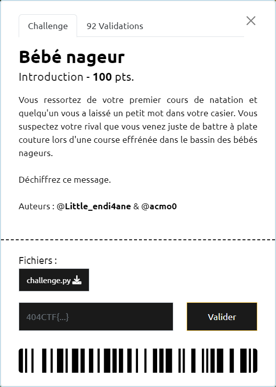

# Bébé nageur

----

On est ici face à un [chiffrement affine](https://fr.wikipedia.org/wiki/Chiffre_affine).

Comme on sait que le flag débute par `404CTF{`, on connait donc le chiffrement pour au moins 2 caractères. On peut définir un système composé de 2 équations linéaires avec `a` et `b` comme inconnues.

Par exemple en prenant les 2 premiers caractères, on a donc :
- f('4') = '-'
- f('0') = '4'

En utilisant les codes ASCII cela donne :

$$
\left.
    \begin{array}{ll}
        a \cdot 56 + b \equiv 65 \pmod n
        \\
        a \cdot 52 + b \equiv 56 \pmod n
    \end{array}
\right\rbrace

\Rightarrow

(a, b) = (19, 6)
$$

Il ne reste plus qu'à implémenter la fonction inverse de `f` pour déchiffrer `ENCRYPTED_FLAG`.

Le script [challenge-reverse.py](./challenge-reverse.py) implémente une solution et permet ainsi d'obtenir le flag `404CTF{Th3_r3vEnGE_1S_c0minG_S0oN_4nD_w1Ll_b3_TErRiBl3_!}`
