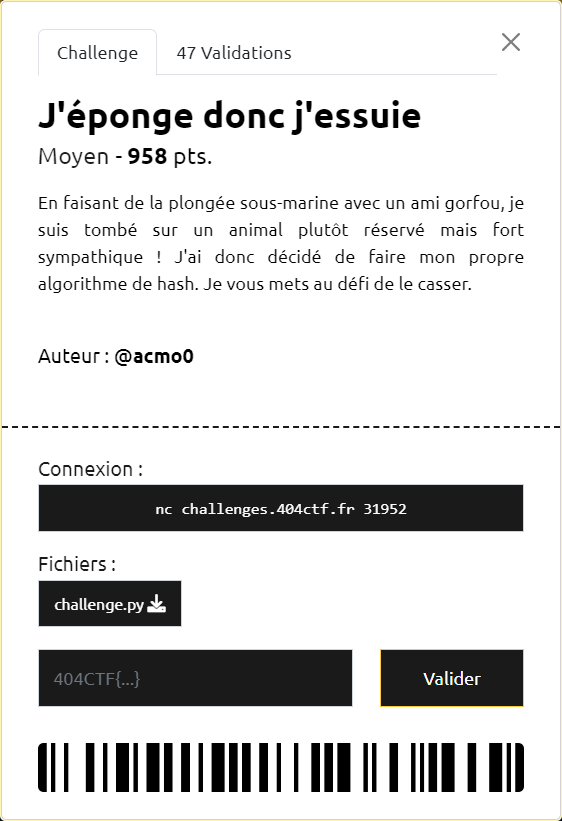

# J'éponge donc j'essuie



----

### 1. Analyse du script

Le script [`challenge.py`](./challenge.py) génère un message aléatoirement (`os.urandom(16)`) et calcule son hash. Le but du jeu est d'arriver à trouver un autre message, de longueur différente, ayant le même hash.

Toute les opérations passent par `Bob`.

A l'initialisation :
- les données sont converties en tableau de bits, après les avoir préfixées et suffixées par leur taille.
- un état `state`, composé d'un tableau de bits en 2 parties (32 et 96 bits), est également initialisé avec uniquement des `0`.

Le calcul du hash est réalisé en 2 temps :
- une phase d'absorption `_absorb()` consistant à "absorber" les données dans le `state`
- une phase de restitution `_squeeze()` consistant à restituer ce `state`

Dans chacune de ces 2 phases, les données sont traitées par bloc de 32 bits, avec une permutation des bits du `state` réalisée à chaque fois qu'un bloc vient d'être traité, via `_f`.

----

### 2. Etude des permutations

L'analyse de la "sbox" `perm` utilisée pour réaliser les permutations montre que celle-ci est composée de 5 cycliques :

```py
cycles = [
 [0, 65, 62, 56, 61, 10, 41, 27, 98, 126, 59, 50, 89, 24, 81, 5, 35, 47, 21, 91, 43, 32, 64, 38, 104, 54, 25, 26],
 [1, 107, 57, 39, 113, 55, 102, 79, 122, 106, 31, 112, 20, 7, 100, 52, 36, 114, 40, 3, 90, 94, 115, 111, 60, 14, 70, 108], 
 [2, 53, 110, 88, 96, 76, 74, 49, 99, 109, 87, 123, 83, 97, 80, 58, 86, 117, 44, 42, 6, 17, 73, 125, 124, 78, 8, 37, 30, 9, 103, 72, 13, 120, 68, 66, 22, 127, 119, 85, 63, 28, 71, 18, 16, 34, 101, 12, 23, 69, 19, 29, 51, 84, 15, 11, 92, 4, 67, 46, 48, 118, 82, 75], 
 [33, 121, 105, 77, 95, 45, 93], 
 [116]
]
```

On constate notamment que les 2 derniers sont composés uniquement de valeurs supérieures à 31. Par conséquent les bits du `state` positionnés à ces index, resteront toujours à leurs valeurs initiales (i.e. `0`). Ce constat n'a pas plus d'utilité pour la suite.

`_f` étant une simple permutation, il est relativement facile d'implémenter sa fonction inverse `_inverse_f`.

----

### 3. Analyse complémentaire et expérimentation

La fonction `_squeeze()` se basant exlusivement sur le `state`, une fois les données absorbées, on n'a aucune influence dessus.

Le seul moyen d'agir est donc au moment de l'absorption.

Pour essayer de mieux comprendre ce qui se passe, on décline le script en une version [`challenge2.py`](./challenge2.py) que l'on va adapter (notamment pour pouvoir réutiliser le code directement) et enrichir (avec des logs).

On va alors s'outiller d'une classe `Patrick` (le copain de Bob) afin de capter lors de l'absorption l'état du `state` avant la dernière permutation. Ce sera le `state` témoin que l'on visera à obtenir avec notre message.

`Patrick` nous sert aussi à mémoriser les `data` avant leur absorption.

----

### 4. Génération de la collision

Pour démarrer, on va prendre comme message candidat `fake_data` le message généré aléatoirement `data` qui est fourni, auquel on rajoute `x00` pour en modifier la taille.

On calcule ensuite le même état `state` obtenu grâce à `Patrick`, que pour le message généré.

On compare les `state` des 2 messages, qui sont globalement identiques. Pour les quelques écarts, on procède à un ajustement de notre `fake_data` en s'appuyant sur les cycles de `perm` et le fait que des XOR soient réalisés lors de la phase d'absorption.

Le script [`bob-reverse.py`](./bob-reverse.py) est celui qui a été utilisé pour trouver `749bfdedfb96f03b651a7b96f38c6ac210` qui a le même hash que `749bfdedfb96f03b650a7b96f38c6fc2`, et qui a ainsi permis d'obtenir le flag `404CTF{p4dD1nG_1s_A_tRIckY_0p3r@TiOn_bUt_g0od_cHeckS_aR3_aN_H4rd3r_0n3}`

```sh
$ nc challenges.404ctf.fr 31952


░▒▓███████▓▒░ ░▒▓██████▓▒░░▒▓███████▓▒░
░▒▓█▓▒░░▒▓█▓▒░▒▓█▓▒░░▒▓█▓▒░▒▓█▓▒░░▒▓█▓▒░
░▒▓█▓▒░░▒▓█▓▒░▒▓█▓▒░░▒▓█▓▒░▒▓█▓▒░░▒▓█▓▒░
░▒▓███████▓▒░░▒▓█▓▒░░▒▓█▓▒░▒▓███████▓▒░
░▒▓█▓▒░░▒▓█▓▒░▒▓█▓▒░░▒▓█▓▒░▒▓█▓▒░░▒▓█▓▒░
░▒▓█▓▒░░▒▓█▓▒░▒▓█▓▒░░▒▓█▓▒░▒▓█▓▒░░▒▓█▓▒░
░▒▓███████▓▒░ ░▒▓██████▓▒░░▒▓███████▓▒░

Welcome ! I'll give you a hash, try to find an other byte sequence of different length that produces the same hash (give me in hex notation please)

Input of hash : 749bfdedfb96f03b650a7b96f38c6fc2
Hash : 804402e08504c1fe124a3a7009e004c299640b1b5098882204b5265100c10411d126c48a86602e340584546687625cc9068049a2864c03c1d58804b3000048e0
> 749bfdedfb96f03b651a7b96f38c6ac210
Congratulation ! Here's the flag : 404CTF{p4dD1nG_1s_A_tRIckY_0p3r@TiOn_bUt_g0od_cHeckS_aR3_aN_H4rd3r_0n3}
```
