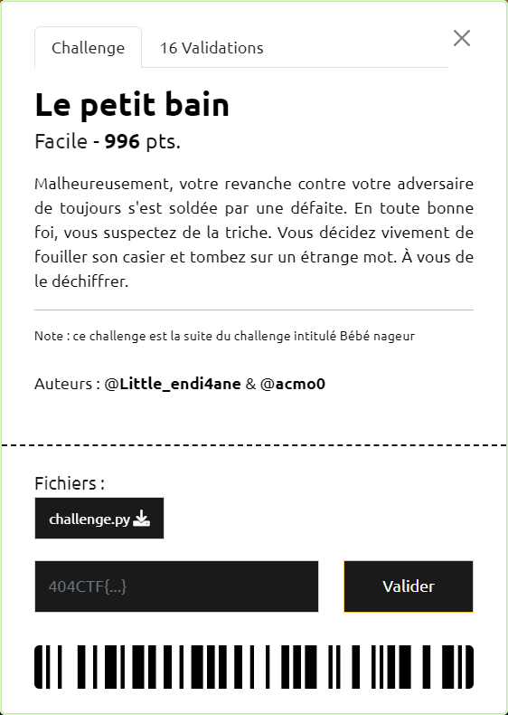

# Le petit bain

----

Comme pour [Bébé nageur](../bebe-nageur/bebe-nageur.md), il s'agit ici aussi de chiffrements affines.

Cependant, le chiffrement appliqué dépend de la position du caractère dans la chaine modulo 6. Il y a donc 6 paires de coefficient `(a, b)` utilisées pour définir 6 fonctions affines $f_{a,b}$, que l'on peut nommer $f_{0}, f_{1}, ..., f_{5}$

En complément, suite au chiffrement, une permutation des caractères est réalisée. A noter que la permutation s'effectue toujours à l'intérieur d'un même groupe de 6 caractères. Par exemple pour le premier "bloc" de 6 caractères, les permutations sont : 0 -> 4 -> 1 -> 3 -> 5 -> 2 -> 0. Et c'est la même permutation qui est appliquée pour les autres blocs de 6 caractères.

Ces 2 opérations (chiffrement + permutation) sont réalisées 6 fois.

Ainsi pour les caractères en position 0, modulo 6, on applique successivement les chiffrements suivants : $f_{0}, f_{4}, f_{1}, f_{3}, f_{5}, f_{2}$.

Etant donné, que la composition de fonctions affines est une fonction affine, en définitive, les caractères en position 0 (modulo 6) subissent un chiffrement affine $g_{0} = f_{2} \circ f_{5} \circ f_{3} \circ f_{1} \circ f_{4} \circ f_{0}$

On note également qu'étant donné que 6 permutations sont réalisées, au bout du cycle, les caractères retrouvent leurs places initiales dans la chaine.

On peut donc se contenter de retrouver les 6 paires de coefficient `(a', b')` de ces 6 fonctions $g_{0}, g_{1}, ..., g_{5}$.

Or on dispose des 12 premiers caractères du flag à retrouver, à savoir 2 caractères pour chacunes des 6 fonctions affines.

On a donc 6 systèmes, composés chacun par 2 équations linéaires dont les `a'` et `b'` sont les inconnues.

Une fois les coefficients identifiés, on peut définir les fonctions de déchiffrement.

Le script [`challenge-reverse.py`](./challenge-reverse.py) permet de réaliser l'ensemble des opérations et d'obtenir le flag `404CTF{tHe_c4fF31ne_MakE5_m3_StR0nG3r_th4n_y0u!}`.
