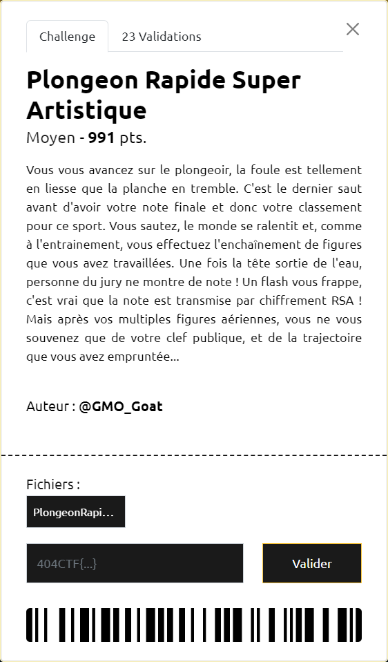

# Plongeon Rapide Super Artistique



----

### 1. Analyse du script

Le script fourni [`PlongeonRapideSuperArtistique.py`](./PlongeonRapideSuperArtistique.py) chiffre le `flag` via RSA.

On dispose de :
- `N` : un polynôme de degré 14
- `n` : le module de chiffrement
- `e` : l'exposant de chiffrement classique `65537`
- `c` : le flag chiffré

La particularité est ici la façon de déterminer `n`.

Le script commence par générer 2 polynômes $P$ et $Q$ $\in \mathbb{Z}[X]$ qui sont :
- de degré 7
- irréductibles (sur $\mathbb{Q}[X]$)
- premiers entre eux
- dont les coefficients sont des entiers $\in \lbrace2^{31}, 2^{31}+1, 2^{31}+2, \ldots, 2^{32}-1 \rbrace $

Le polynome $N$ est alors défini comme le produit de $P$ et $Q$ :

$$
N = P \cdot Q
$$

Un entier `r` est ensuite généré aléatoitement tel que :
- $r \in \lbrace 2^{67}, 2^{67}+1, 2^{67}+2, \ldots, 2^{68}-1 \rbrace$
- `p` et `q` soient 2 nombres premiers définis à partir de `r` :

$$
\left\lbrace
    \begin{array}{ll}
        p = P(r)
        \\
        q = Q(r)
    \end{array}
\right.
$$

Pour finir, `n` est défini comme suit :

$$
n = p \cdot q = P(r) \cdot Q(r) = N(r)
$$

----

### 2. Stratégie générale

La stratégie globale utilisée est la suivante :
1. Retrouver `r`
2. Factoriser $N$ pour retrouver $P$ et $Q$
3. Connaissant `r`, on sait alors retrouver `p` et `q`, puisque $p = P(r)$ et $q = Q(r)$
4. Connaissant `p` et `q`, déterminer `d` l'exposant de déchiffrement devient facile, puisque par définition : $e \cdot d \equiv 1 \pmod{\phi(n)}$ avec $\phi(n) = (p-1) \cdot (q-1)$
5. On dispose alors de tous les éléments pour déchiffrer `c` et ainsi retrouver le `flag` : $flag \equiv c^{d} \pmod{n}$

----

### 3. Retrouver `r`

Que sait-on sur `r` ?

On sait que $r \in \lbrace 2^{67}, 2^{67}+1, 2^{67}+2, \ldots, 2^{68}-1 \rbrace$ et que $n = N(r)$.

L'idée est ensuite de représenter `r` sous la forme de la somme de puissances de 2 :

$$
r = \sum_{i=0}^{67}(\alpha_{i} \cdot 2^{67-i}), \ avec \ \alpha_{i} \in \lbrace 0, 1 \rbrace
$$

et de remarquer que :

$$
\forall n \in \mathbb{N}, 2^{n} = 1 + \sum_{i=0}^{n-1}2^{i}
\Rightarrow 2^{n} \gt \sum_{i=0}^{n-1}2^{i}
$$

Comme tous les coefficients de $N$ sont positifs :

$$
a \le b \iff N(a) \le N(b)
\\
a \gt b \iff N(a) \gt N(b)
$$

Par conséquent, on a les équivalences suivantes :

$$
\left\lbrace
    \begin{array}{ll}
        \alpha_{1}=1 \iff 2^{67}+2^{66} \le r \iff N(2^{67}+2^{66}) \le N(r) \iff N(r) - N(2^{67}+2^{66}) \ge 0 \iff n - N(2^{67}+2^{66}) \ge 0
        \\
        \alpha_{1}=0 \iff 2^{67}+2^{66} \gt r \iff N(2^{67}+2^{66}) \gt N(r) \iff N(r) - N(2^{67}+2^{66}) \lt 0 \iff n - N(2^{67}+2^{66}) \lt 0
    \end{array}
\right.
$$

Si on pose $n' = N(2^{67}+2^{66})$, on voit qu'il suffit de comparer $n$ et $n'$ pour connaitre la valeur de $\alpha_{1}$

Ensuite on peut procéder par récurrence, pour déterminer les valeurs suivantes des $\alpha_{i}$ pour $i \in \lbrace 2, \ldots, 67 \rbrace$.

Ainsi, une fois $\alpha_{1}$ déterminé, pour déterminer $\alpha_{2}$, il suffit de comparer $n$ avec $n'$ en prenant :

- si $\alpha_{1}=1$, $n' = N(2^{67}+2^{66}+2^{65})$
- si $\alpha_{1}=0$, $n' = N(2^{67}+0+2^{65})$

Si $n - n' \ge 0$ , alors $\alpha_{2} = 1$, sinon $\alpha_{2} = 0$

----

### 4. Obtention du flag

Le script [`plongeon-reverse.sage`](./plongeon-reverse.sage) implémente cette stratégie et permet de récupérer le flag `404CTF{L3_JURy_V0u5_4_477ri8u3R_L3_plu5_34u_5C0r3_v0u5_V07r3_P3rf0rm4nc3_34ud4ci3u23}` :

```sh
$ sage reverse.sage
r_min=147573952589676412928, r_max=295147905179352825855
r=159893419918318532322
P=3771257363*x^7 + 2187876102*x^6 + 3343460789*x^5 + 2973532628*x^4 + 2270245903*x^3 + 2634087910*x^2 + 2159836359*x + 2346852397
Q=4028893023*x^7 + 3191305088*x^6 + 2962980349*x^5 + 3307477363*x^4 + 4071918546*x^3 + 2175376981*x^2 + 2508855504*x + 3326702497
flag=b'404CTF{L3_JURy_V0u5_4_477ri8u3R_L3_plu5_34u_5C0r3_v0u5_V07r3_P3rf0rm4nc3_34ud4ci3u23}'
```
