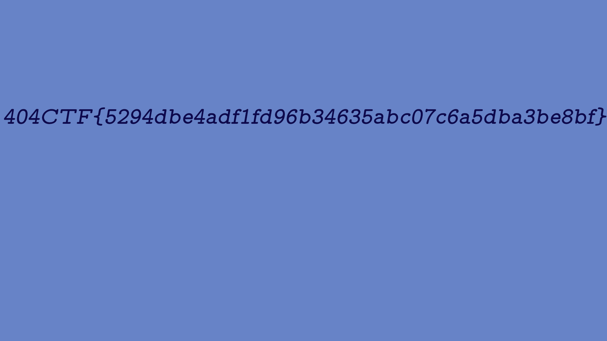

# Poor Random Number Generator [1/2]

----

L'archive [`challenge.zip`](./challenge.zip) contient :
- `encrypt.py`: le script qui a été utilisé pour chiffrer le fichier `flag.png`
- `my_random.py`: le code de la classe `Generator` utilisée par `encrypt.py`
- `flag.png.part`: la partie claire du fichier `flag.png` qui a fuité
- `flag.png.enc`: le chiffré du fichier `flag.png`

On commence par analyser le script de chiffrement :
- Les données à chiffrer sont découpées en bloc de 4 octets
- Un padding avec des `\x00` est appliqué sur le dernier bloc (afin d'avoir des blocs tous constitués de 4 octets). Si la taille des données à chiffrer est déjà un multiple de 4, alors un bloc `'\x00\x00\x00\x00'` est rajouté en fin.
- Un One Time Pad est généré via la classe `Generator` pour chaque bloc
- Celui-ci est alors utilisé comme masque (de type XOR) appliqué au bloc.

Le `Generator` est constitué d'un état `feed` qui est initialisé avec un seed composé de 2.000 octets définis aléatoirement (cf. `__init__`).

La fonction `get_next_byte` permet d'obtenir une valeur "générée". La génération s'appuie exclusivement sur l'état courant du `feed`. Une fois la génération réalisée, le `feed` est mis à jour : le 1er octet est abandonné et la valeur générée positionnée en fin.

Comme la partie claire qui a fuité contient plus de 2.000 octets, en appliquant un XOR avec la partie chiffrée, on sait déterminer les 2.000 premières valeurs issues de la génération.

Mais de part le fonctionnement de `get_next_byte` (avec le "décalage" appliqué pour mettre à jour le `feed` à chaque génération), celles-ci constituent également l'état du `feed` après 2.000 générations.

A partir de là, connaissant le `feed` il est possible d'obtenir les valeurs générées suivantes. Il suffit d'initialiser le `Generator` avec cet état, au lieu de le définir aléatoirement.

Pour pouvoir réutiliser le code existant, on adapte légèrement les 2 scripts [`encrypt.py`](./encrypt.py) et [`my_random.py`](./my_random.py)

Le script [`poor-reverse.py`](./poor-reverse.py) permet de reconstituer le fichier `flag.png` :

On obtient ainsi le flag `404CTF{5294dbe4adf1fd96b34635abc07c6a5dba3be8bf}`
