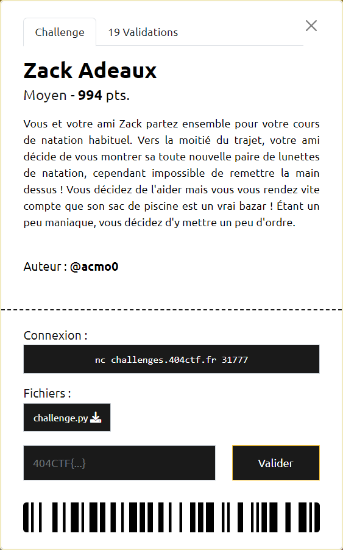

# Zack Adeaux



----

### 1. Analyse du script

On dispose ici du script [`challenge.py`](./challenge.py) qui est exécuté sur le serveur.

Celui-ci nous fournit, encodé en base64, un json qui contient :
- `encrypted` : le flag chiffré
- `public_key`: la clé publique utilisée pour le chiffrement

La clé publique `public_key` est composée d'un tableau de 256 entiers de "grande" taille définis "aléatoirement" : $B = [b_{0}, b_{1}, \ldots, b_{255}]$

Le chiffrement consiste à :
- transformer la donnée à chiffrer $m$ en un tableau de bits : $m = [m_{0}, m_{1}, \ldots, m_{255}]$ avec $\forall i, m_{i} \in \lbrace 0, 1 \rbrace$
- à multiplier ce bit par l'entier de la clé publique positionné au même index
- et pour finir à en faire la somme

On a donc : 

$$
encrypted = \sum_{i=0}^{255} m_{i} \cdot b_{i}
\ avec \ m_{i} \in \lbrace 0, 1 \rbrace
$$

Comme on connait les $b_{i}$, le challenge revient à retrouver les $m_{i}$ à partir de `encrypted` et `public_key`.

NB : le corollaire de cette méthode de chiffrement est que le flag possède une taille maximale de 256 bits.

Le format du flag étant `404CTF{xxxxxxx}` on connait quelques valeurs des $m_{i}$ mais pas suffisamment pour tester toutes les combinaisons de $m_{i}$ possibles dans un temps raisonnable.

----

### 2. Approche

Bien que la clé publique utilisée pour le chiffrement soit différente à chaque sollicitation du serveur, le flag lui reste le même.

Par conséquent, si on capte 256 jeux de données différents (i.e. par exemple pour lesquels les $b_{0}$ sont tous différents 2 à 2), on est alors capable de se ramener à la résolution d'un système composé de 256 équations linéaires dont les inconnues sont les 256 $m_{i}$ :

$$
\begin{array}{ll}
b_{0,0} \cdot m_{0} + b_{1,0} \cdot m_{1} + \ldots + b_{255,0} \cdot m_{255} = encrypted_{0}
\\
b_{0,1} \cdot m_{0} + b_{1,1} \cdot m_{1} + \ldots + b_{255,1} \cdot m_{255} = encrypted_{1}
\\
\ldots
\\
b_{0,j} \cdot m_{0} + b_{1,j} \cdot m_{1} + \ldots + b_{255,j} \cdot m_{255} = encrypted_{j}
\\
\ldots
\\
b_{0,255} \cdot m_{0} + b_{1,255} \cdot m_{1} + \ldots + b_{255,255} \cdot m_{255} = encrypted_{255}
\end{array}
$$

que l'on peut aussi représenter sous forme matricielle :

$$
\begin{pmatrix}
b_{0,0} & b_{1,0} & \ldots & b_{255,0}
\\
b_{0,1} & b_{1,1} & \ldots & b_{255,1}
\\
\ldots & \ldots & \ldots & \ldots
\\
b_{0,j} & b_{1,j} & \ldots & b_{255,j}
\\
\ldots & \ldots & \ldots & \ldots
\\
b_{0,255} & b_{1,255} & \ldots & b_{255,255}
\end{pmatrix}
\cdot
\begin{pmatrix}
m_{0} \\\ m_{1} \\\ \ldots \\\ m_{j} \\\ \ldots \\\ m_{255}
\end{pmatrix}
= \begin{pmatrix}
encrypted_{0} \\\ encrypted_{1} \\\ \ldots \\\ encrypted_{j} \\\ \ldots \\\ encrypted_{255}
\end{pmatrix}
$$

----

### 3. Mise en pratique

Même s'il ne semble pas y avoir de difficulté théorique, la partie implémentation peut réserver quelques surprises, notamment du fait de la grande taille des entiers manipulés.

Après expérimentation avec [Sage](https://www.sagemath.org/) sur des matrices 3x3 constituées de tels entiers, on s'aperçoit que l'outil ne sait pas inverser de telles matrices.

Afin de manipuler des nombres de taille raisonnable, pour chaque équation, on va appliquer $encrypted$ comme diviseur. Comme celui-ci est par construction un majorant des $b_{i}$ on a :

$$
\forall i, b_{i}^{\prime} = \frac{b_{i}}{encrypted} \Rightarrow 0 \lt b_{i}^{\prime} \lt 1
$$

Le système à résoudre devient alors :

$$
\begin{pmatrix}
b_{0,0}^{\prime} & b_{1,0}^{\prime} & \ldots & b_{255,0}^{\prime}
\\
b_{0,1}^{\prime} & b_{1,1}^{\prime} & \ldots & b_{255,1}^{\prime}
\\
\ldots & \ldots & \ldots & \ldots
\\
b_{0,j}^{\prime} & b_{1,j}^{\prime} & \ldots & b_{255,j}^{\prime}
\\
\ldots & \ldots & \ldots & \ldots
\\
b_{0,255}^{\prime} & b_{1,255}^{\prime} & \ldots & b_{255,255}^{\prime}
\end{pmatrix}
\cdot
\begin{pmatrix}
m_{0} \\\ m_{1} \\\ \ldots \\\ m_{j} \\\ \ldots \\\ m_{255}
\end{pmatrix}
= \begin{pmatrix}
1 \\\ 1 \\\ \ldots \\\ 1 \\\ \ldots \\\ 1
\end{pmatrix}
$$

La résolution nécessitant de manipuler des `float`, et non des `int`, on a alors une perte de précision sur le résultat des $m_{i}$ obtenus.

On espère qu'en appliquant un arrondi, on puisse retrouver des $m_{i} \in \lbrace 0, 1 \rbrace$

----

### 4. Solution implémentée

La 1ère étape consiste donc à utiliser le script [`collect.py`](./collect.py) pour récupérer les jeux de données dans un fichier `collect.data`, dont voici une version compressée : [`collect.zip`](collect.zip)

Il ne reste plus qu'à résoudre le système d'équations pour retrouver les bits, puis reconstruire les octets.

A noter que lors du chiffrement, la phase de transformation du flag en tableau de bits a été réalisée avec la fonction `bin`. Par conséquent les premiers bits `0` n'y sont pas présents. Or le flag commençant par `4`, il manque donc 2 `0` qu'il faut repositionner avant de reconstruire la chaine :

```py
>>> bin(int.from_bytes(b'4', 'big'))[2:]
'110100'
```

Le script [`zack-reverse.py`](./zack-reverse.py) permet de réaliser cette 2ème étape et ainsi obtenir le flag `404CTF{uN_s4C_@_d0s_B13n_r4Ng3!}`. A noter qu'il s'appuie sur une implémentation du pivot de gauss (cf. [`gauss.py`](./gauss.py)) pour résoudre le système d'équations linéaires.
