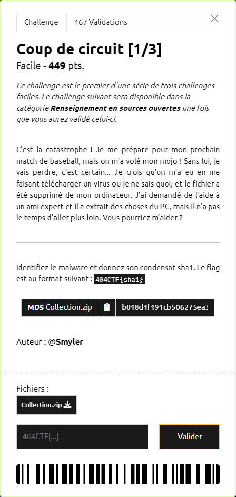
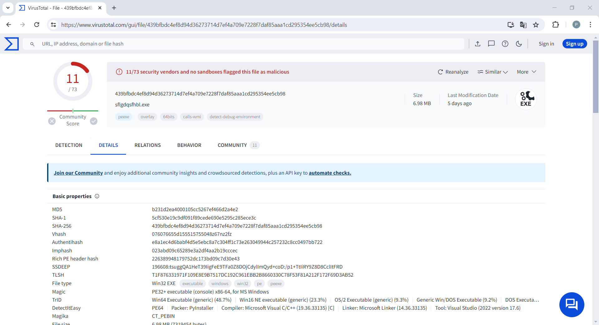

# Coup de circuit [1/3]

----

Parmi les processus relevés dans le fichier `amcache\20240505010820_Amcache_UnassociatedFileEntries.csv`, le processus `sflgdqsfhbl.exe` attire l'attention :
- il est situé dans le répertoire `c:\users\rick\downloads`
- c'est le seul pour lequel certaines informations sont vides (nom, version, ...)

Une recherche sur [VirusTotal](https://www.virustotal.com/gui/home/search) avec le SHA1 `5cf530e19c9df091f89cede690e5295c285ece3c` de ce processus `sflgdqsfhbl.exe` indique bien qu'il s'agit d'un virus :

Le flag est donc `404CTF{5cf530e19c9df091f89cede690e5295c285ece3c}`
