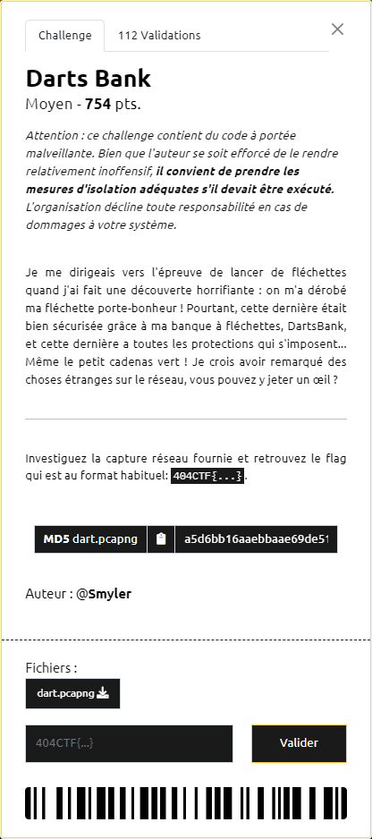
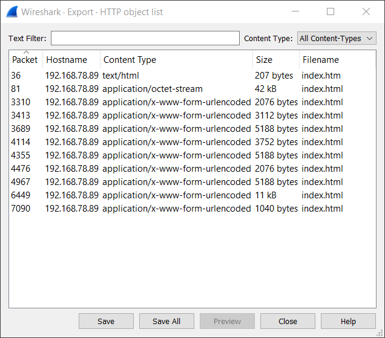
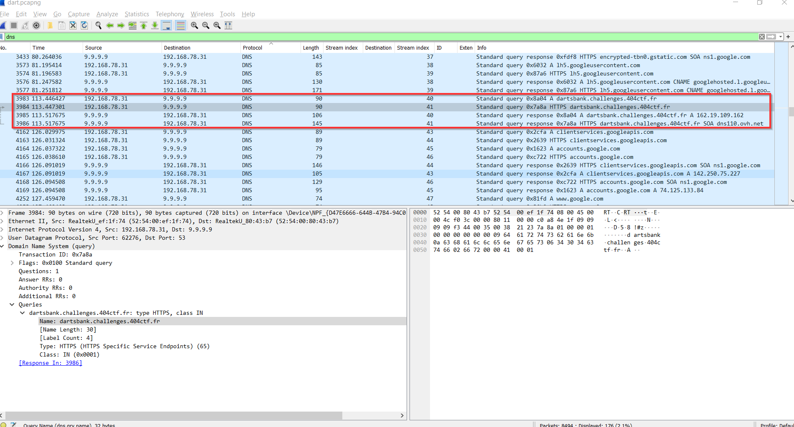
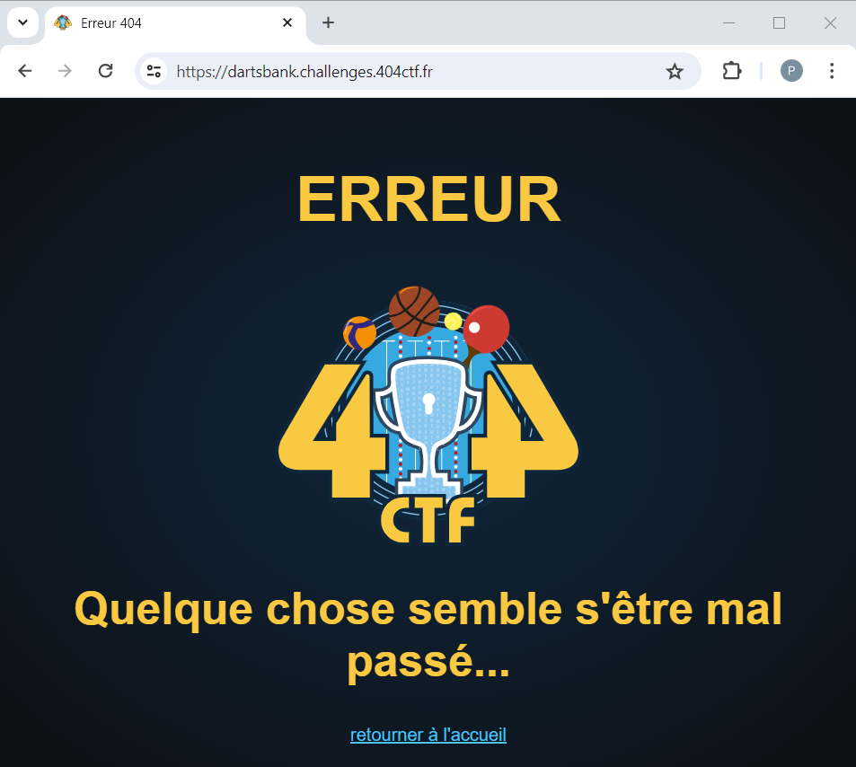
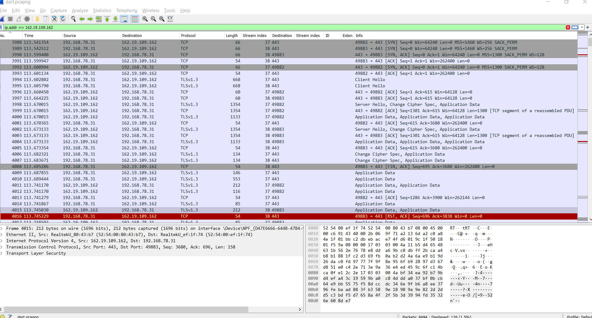
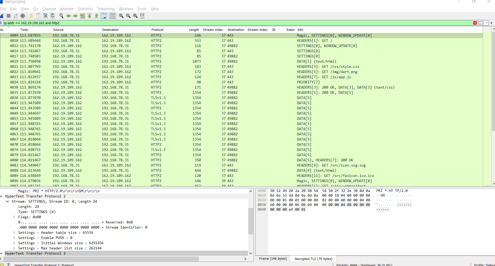
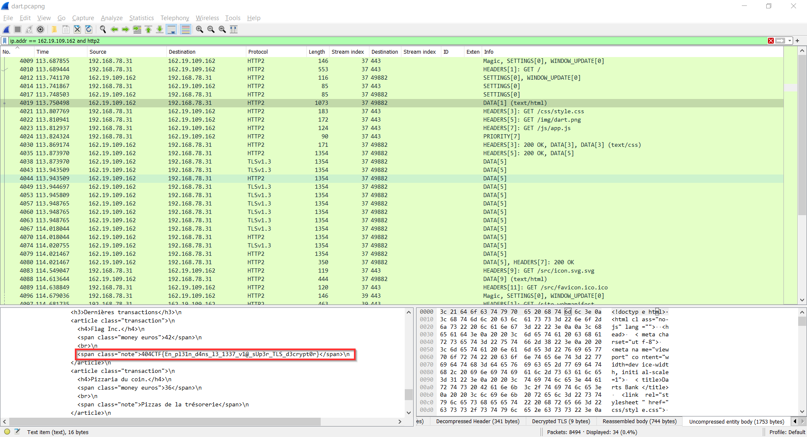

# Darts Bank

----

On utilise Wireshark pour ouvrir le fichier [`dart.pcapng`](./dart.pcapng).

On commence par regarder si des données ont été échangées en HTTP (File  > Export Objects > HTTP) :

On sauvegarde l'ensemble des résultats et on examine rapidement le contenu des différents fichiers :
- `index.htm` : un message d'erreur indique que la ressource recherchée (i.e. `/index.htm`) n'existe pas
- `index.html` (celui associé à la trame 81) : il s'agit ici visiblement d'un script powershell avec des parties encodées en base64.
- les autres `index.html` : le contenu semble encodé en base64.

Pour débuter, on va s'intéresser au fichier [`index.html`](./81-index.html) associé à la trame 81, et on commence par en décoder le contenu afin de reconstruire les différentes commandes : [`81-index.ps1`](./81-index.ps1)

Notre oeil est rapidement attiré par `https://hello.smyler.net` permettant de se faire gentillement "RickRoll".

En examinant de plus près le script on en déduit que celui-ci :
- crée un raccourci de lancement de Chrome, avec l'option `--ssl-key-log-file`, permettant de capturer la clé de Session "SSL" utilisée dans les échanges HTTPS. C'est le fichier `%TEMP%\defender-res.txt` qui est utilisé pour stocker cette clé.
- que la clé de Session "SSL" est ensuite "encodée" (tout dabord en y appliquant un XOR par rapport au tableu de bytes `$aaaaaaaaaaaa`, puis un base64 sur le résultat obtenu)
- puis envoyée encodée en POST à `http://192.168.78.89/index.html`

On comprend maintenant que le contenu des autres appels à `index.html` contient les différentes clés de session utilisées, dont on sait décoder le contenu.

Reste à savoir quelle partie de la capture examiner.

En utilisant `dns` comme filtre dans Wireshark, on peut lister les différentes trames en lien avec ce protocole. Parmi celles-ci, une recherche pour faire des appels HTTPS vers `dartsbank.challenges.404ctf.fr` :

Même si la page `https://dartsbank.challenges.404ctf.fr` existe, celle-ci ne nous aide pas vraiment :

Néanmoins, on peut se dire qu'il faut se focaliser sur les trames échangées avec ce site, dont l'IP est `169.19.109.162` (cf. réponse DNS présente dans la capture). Pour cela, on applique le filtre `ip.addr == 162.19.109.162` :

Les trames sont chiffrées, mais comme nous disposons des clés utilisées, il va être possible de les utiliser pour les déchiffrer.

Grace au script [`darts.py`](./darts.py), on récupère les 9 fichiers "ssl-key-log-file" (`SSLKEYLOGFILE_m1.log` à `SSLKEYLOGFILE_m9.log`) à partir des données qui ont été envoyées dans les trames (cf. Export des objets HTTP réalisé plus haut)

Les échanges qui nous intéressent sont ceux situés entre les trames 4000 et 4107, par conséquent on va utiliser le fichier [`SSLKEYLOGFILE_m4.log`](./SSLKEYLOGFILE_m4.log) correspondant à la trame 4114, pour déchiffrer les échanges (Edit > Preferences > Protocols > TLS > (Pre)-Master-Secret log filename = SSLKEYLOGFILE_m4.log). En utilisant le filtre `ip.addr == 162.19.109.162 and http2`, on se limite aux trames intéressantes :

Le flag `404CTF{En_pl31n_d4ns_l3_1337_v1@_sUp3r_TLS_d3crypt0r}` apparaît alors dans le contenu de la trame 4019 :

