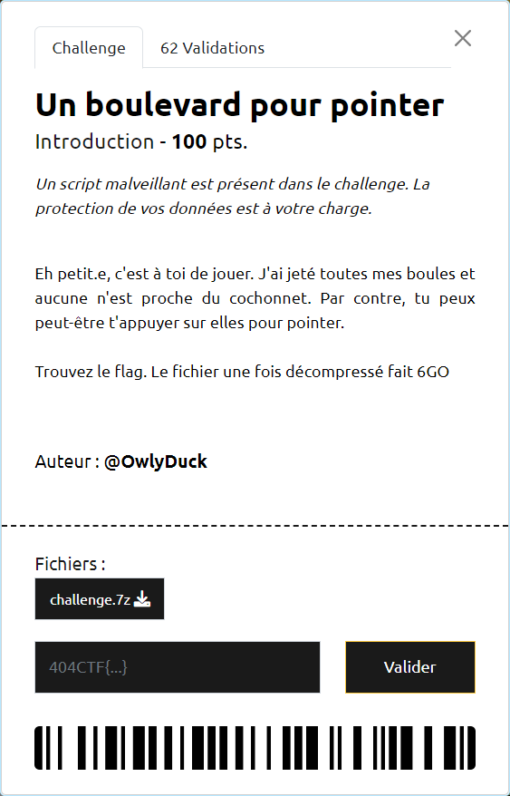

# Un boulevard pour pointer

----

En ouvrant le fichier avec [Autospy](https://github.com/sleuthkit/autopsy/releases/), et en regardant les fichiers "supprimés", parmi les fichiers PDF, on trouve celui-ci : [/img_image.img/vol_vol5/$CarvedFiles/6/f1783544.pdf](./f1783544.pdf)

Le flag `404CTF{bi1_joué_br4vo_c_le_fl4g}` est inscrit dedans.
