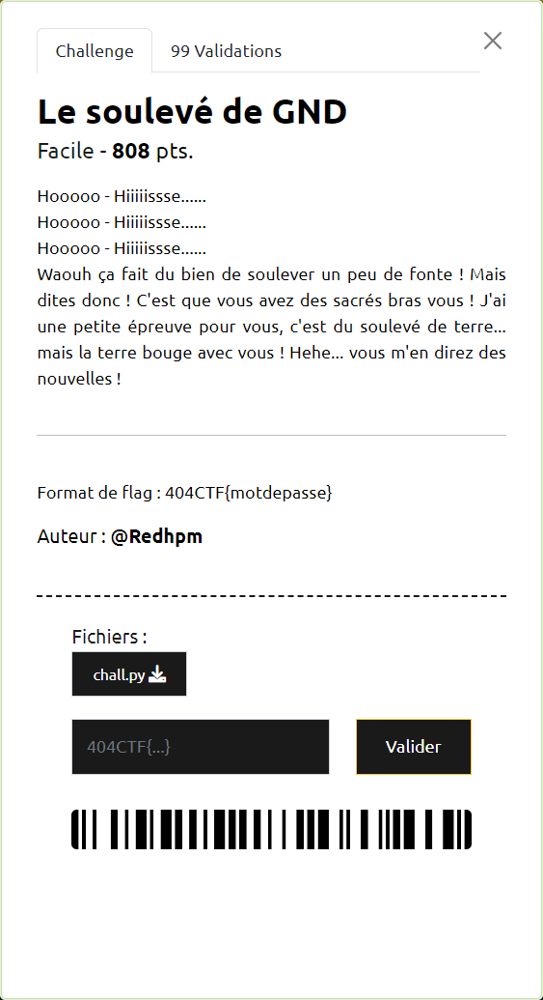

# Le soulevé de GND



----

A la lecture du script [`chall.py`](./chall.py), il semble que l'objectif soit de retrouver un mot de passe de longueur `N = 25` caratères, qui une fois transporté doit correspondre à un Signal donné `data = [78, 114, 87, 9, 245, 67, 252, 90, 90, 126, 120, 109, 133, 78, 206, 121, 52, 115, 123, 102, 164, 194, 170, 123, 5,]`

Ne comprenant pas exactement comment faire, j'ai utilisé une approche empirique en utilisant une version quelque peu modifiée du script [`chall2.py`](./chall2.py).

Grace à un log ajouté juste avant le test de comparaison entre le signal reçu `v` et celui attendu `data[sel]` et plusieurs tests successifs, on peut reconstituer caractère par caractère le mot de passe et ainsi obtenir le flag `404CTF{N3_perd3z_P45_v0tr3_t3rRe}`.

```diff
    @always(clk.posedge)
    def core():
+       print(f'{s=}, {data[sel]}, {v=}, {v._val._val=}')
        s.next &= data[sel] == v

        if sel == N - 1:
            if s.next:
                print("GG ! Le flag est 404CTF{Le mot de passe}")
            else:
                print("uh oh...")

    return core
```
