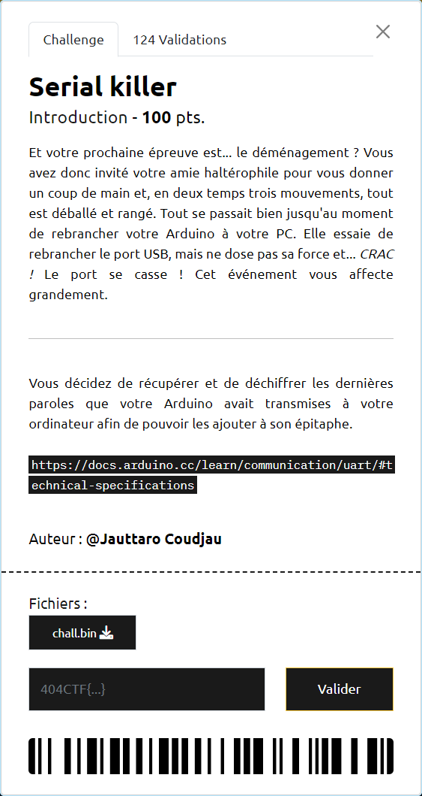

# Serial killer

----

Le [lien](https://docs.arduino.cc/learn/communication/uart/#technical-specifications) fourni permet de comprendre comment une trame [UART](https://fr.wikipedia.org/wiki/UART) est constituée :
- elle débute par un bit `0`
- suivent ensuite 7 bits de données
- puis un bit de parité, servant à détecter les éventuelles erreurs de transmission
- et se termine par un bit `1`

La première étape consiste donc à récupérer la suite des bits du fichier `chall.bin`

Puis, à extraire uniquement les bits de données.

Et pour finir, à lire ces 7 bits en LSB.

Le script [`serial.py`](./serial.py) implémente cette stratégie et permet de récupérer les données : `404CTF{Un3_7r1Ste_f1N_p0Ur_uN3_c4r73_1nn0c3nt3}`
