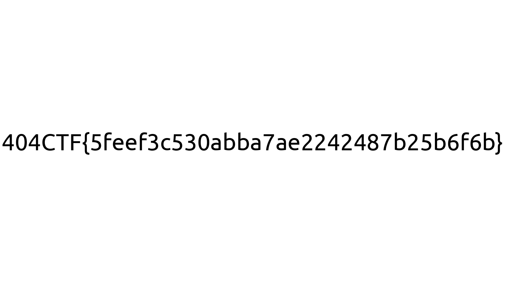

# De la friture sur la ligne


----

### 1. Analyse du problème

Le fichier [`challenge.zip`](./challenge.zip) contient :
- un script `challenge.py`
- 8 fichiers channels numéroté de 1 à 8 (`channel_1` à `channel_8`) contenant uniquement une suite de `0` et `1`

La lecture du script nous permet de comprendre :
- qu'un fichier `flag.png` a été encodé
- que le résultat de cet encodage correspond aux 8 fichiers channels fournis

L'encodage est réalisé via `encode_file` et il se déroule en 2 temps :
1. transformation du contenu du fichier en un tableau de `bits`
2. pour chaque groupe de 7 bits, ajout d'un bit de parité :

    > ```py
    > def encode_data(d):
	>   return list(d)+[sum([e for e in d])%2]
    >```

    `list(d)` contient les 7 bits

    `sum([e for e in d])%2` permet de calculer la parité de la somme de ces 7 bits

Les bits ainsi obtenus, sont ensuite ventilés via `transmit` dans les 8 fichiers channels :
- les bits 0,  8, 16, ... dans le fichier `channel_1`
- les bits 1,  9, 17, ... dans le fichier `channel_2`
- les bits 2, 10, 18, ... dans le fichier `channel_3`
- les bits 3, 11, 19, ... dans le fichier `channel_4`
- les bits 4, 12, 20, ... dans le fichier `channel_5`
- les bits 5, 13, 21, ... dans le fichier `channel_6`
- les bits 6, 14, 22, ... dans le fichier `channel_7`
- les bits 7, 15, 23, ... dans le fichier `channel_8`

Ainsi les fichiers `channel_1` à `channel_7` contiennent les bits du fichier `flag.png` de départ, et le fichier `channel_8` contient les bits de parité.

Sauf que pour le fichier `channel_4` au lieu de transmettre correctement les données (cf. `good_channel`) celles-ci sont modifiées ou non, de manière aléatoire (cf. `bad_channel`). Le fichier étant corrompu, ses données ne peuvent donc pas être utilisées pour reconstituer les données de départ.

----

### 2. Reconstitution du fichier flag.png

Néanmoins, il est possible de reconstituer le contenu du fichier `channel_4` grâce aux bits de parité :
- si la somme modulo 2 des bits `1`, `2`, `3`, `5`, `6` et `7` est égale au bit de parité, alors cela veut dire que le bit `4` vaut `0`
- sinon, c'est qu'il vaut `1`

NB : Faire la somme module 2, revient à appliquer un `XOR`. Donc le bit `4` est égal au `XOR` des 7 autres bits.

Il suffit ensuite de "recoller" les bits signifiants (i.e. bits `1` à `7`) pour reconstituer le fichier `flag.png`.

Le script [`friture-reverse.py`](./friture-reverse.py) permet de faire la glu et d'obtenir le flag `404CTF{5feef3c530abba7ae2242487b25b6f6b}`



NB : les bits de parité sont couramment utilisés pour détecter des erreurs dans les transmissions ou le stockage (type [RAID](https://fr.wikipedia.org/wiki/RAID_(informatique)) 3, 4, 5 notamment)
