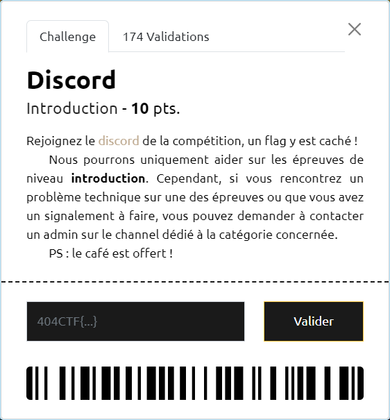
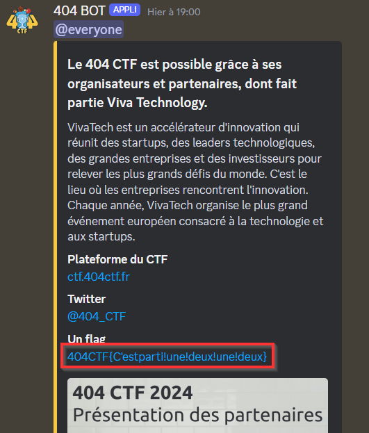

# Discord

Un suivi attentif du channel `#annonces` permet de trouver le flag `404CTF{C'estparti!une!deux!une!deux}` avant même le début de la compétition.

Voici l'[annonce](https://discord.com/channels/958318103962480640/958322334320693299/1230925924971839601) recherchée :

