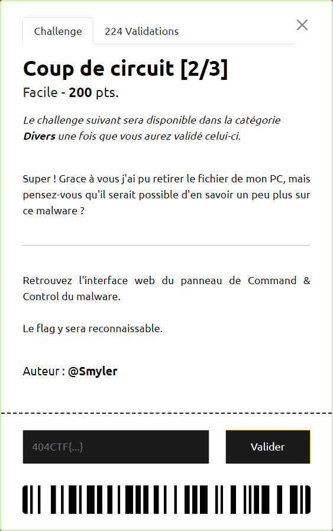
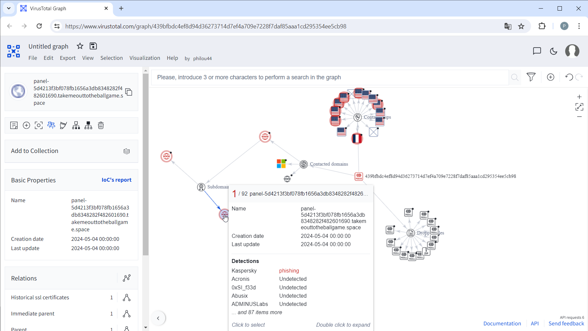
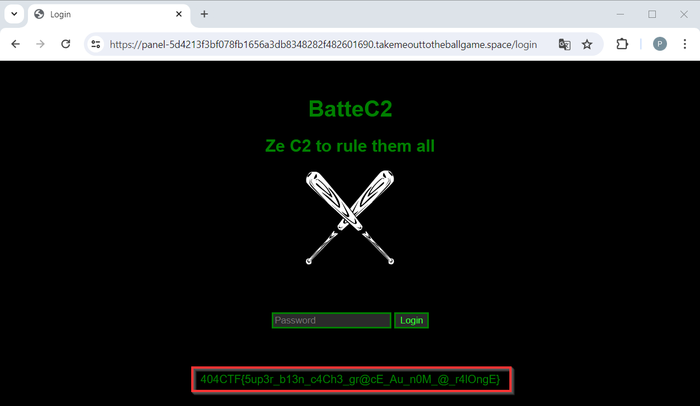

# Coup de circuit [2/3]

----

A l'étape précédente [Coup de circuit [1/3]](../../forensics/coup-de-circuit-1_3/coup-de-circuit-1_3.md), on a trouvé une page référençant le virus sur [VirusTotal](https://www.virustotal.com/gui/file/439bfbdc4ef8d94d36273714d7ef4a709e7228f7daf85aaa1cd295354ee5cb98).

L'exploration du Graph référence une URL : `panel-5d4213f3bf078fb1656a3db8348282f482601690.takemeouttotheballgame.space` :

En suivant [celle-ci](https://panel-5d4213f3bf078fb1656a3db8348282f482601690.takemeouttotheballgame.space/login) on arrive bien sur la page d'authentification de la console où  le flag `404CTF{5up3r_b13n_c4Ch3_gr@cE_Au_n0M_@_r4lOngE}` est présent :

