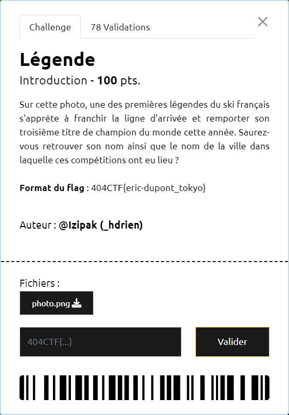

# Légende

----

Une recheche des grandes figures françaises du ski alpin (https://www.google.com/search?q=grand+champion+fran%C3%A7ais+du+ski+alpin) donnent plusieurs liens, dont celui-ci : https://blog.univ-reunion.fr/lamotte/files/2021/03/La-l%C3%A9gende-du-ski-10-exploits-de-skieurs-fran%C3%A7ais.pdf

Le 1er cité est [Émile Allais](https://fr.wikipedia.org/wiki/%C3%89mile_Allais) qui a gagné 3 médailles d'or aux championnats du monde 1937 qui se déroulaient à Chamonix.

Ces éléments semblent correspondrent à la photo :
- ancienneté de la photo (couleur, habits des personnes à gauche)
- le bandeau d'arrivée écrit en français.
- le fanion accroché en haut du poteau d'arrivée ressemble au drapeau français (en noir et blanc)

Quelques recherches complémentaires, permettent de trouver cette vidéo [Emile Allais a 100 ans (Megève)](https://www.dailymotion.com/video/xp3chi).
En se positionnant au chrono 1:02, on retrouve la photo fournie.

Le flag est donc `404CTF{emile-allais_chamonix}`
