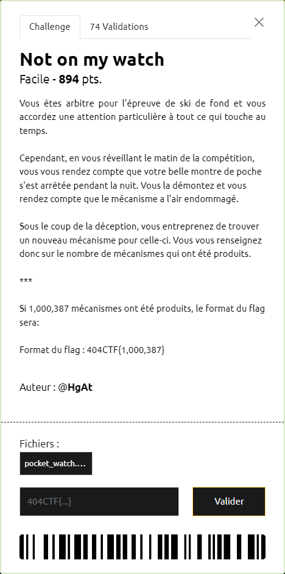
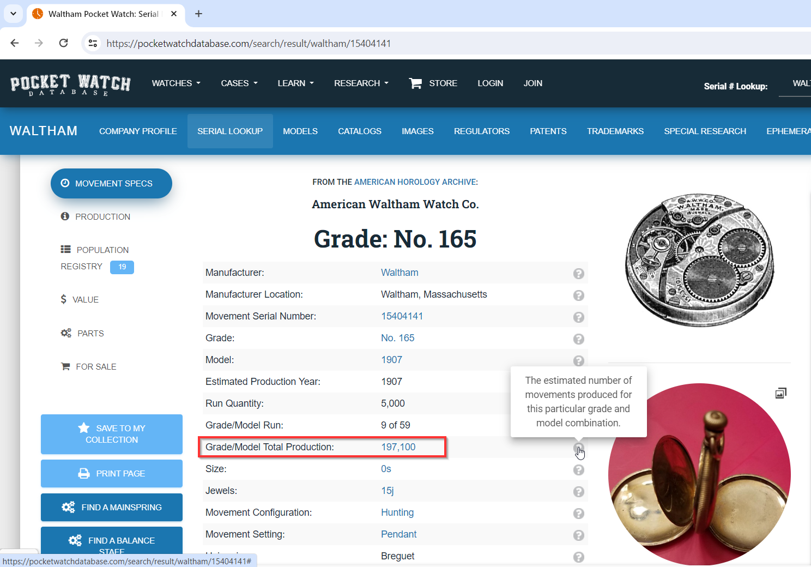

# Not on my watch

----

Sur le mécanisme, on voit 2 inscriptions :
- [Waltham](Waltham_Watch_Company) qui correspond à un ancien industriel américain de montres
- `15404141` qui est probablement le N° de série de la montre.

En faisant quelques recherches, on tombe sur [Pocket Watch Database](https://pocketwatchdatabase.com/) où il est possible d'effectuer une recherche par N° de série et manufacturier (i.e. justement ce dont on dispose grâce à la photo).

Le résultat de la recherche renvoie sur la page https://pocketwatchdatabase.com/search/result/waltham/15404141 :

On y trouve le nombre de mécanismes produits sous cette série et ainsi le flag `404CTF{197,100}`
