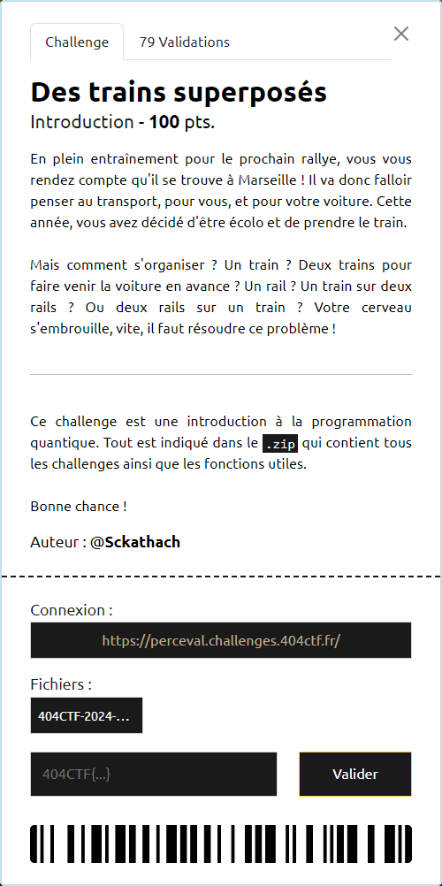

# Des trains superposés



----

### Etape 1

Ce qui est demandé c'est de trouver l'angle $\alpha$ d'un *Beam Splitter*, de sorte qu'avec $|0\rangle$ en entrée, on ait une probabilité de 0.9 d'avoir $|1\rangle$ en sortie.

Il faut donc résoudre le système suivant :

$$
\begin{pmatrix} cos(\frac{\alpha}{2}) & i \cdot sin(\frac{\alpha}{2}) \\\ i \cdot sin(\frac{\alpha}{2}) & cos(\frac{\alpha}{2}) \end{pmatrix}
\cdot
\begin{pmatrix} 1 \\\ 0 \end{pmatrix} =\begin{pmatrix} \sqrt{0.1} \\\ \sqrt{0.9} \end{pmatrix}
$$

donc :

$$
cos(\frac{\alpha}{2}) = \sqrt{0.1}
\Rightarrow
\alpha = 2 \cdot Arccos(\sqrt{0.1})
$$

ce qui se traduit par :

```py
alpha = np.arccos(np.sqrt(0.1))*2
```

----

### Etape 2

Il faut ici trouver les angles $\beta$ d'un *Beam Splitter* et $\gamma$  d'un *Phase Shifter* qui s'enchaine sur le rail 1, de sorte qu'avec $|0\rangle$ en entrée, on obtienne le qubit :

$$
|\psi\rangle = \frac{\sqrt{3}}{2} |0\rangle + \left(\frac{\sqrt{3}}{4} - \frac{i}{4} \right)|1\rangle
$$

Le système à résoudre est donc ici :

$$
\begin{pmatrix} 1 & 0 \\\ 0 & e^{i\gamma} \end{pmatrix}
\cdot
\begin{pmatrix} cos(\frac{\beta}{2}) & i \cdot sin(\frac{\beta}{2}) \\\ i \cdot sin(\frac{\beta}{2}) & cos(\frac{\beta}{2}) \end{pmatrix}
\cdot \begin{pmatrix} 1 \\ 0 \end{pmatrix}
=
\begin{pmatrix} \frac{\sqrt{3}}{2} \\\ \frac{\sqrt{3}}{4} - \frac{i}{4} \end{pmatrix}
$$

soit :

$$
\begin{pmatrix} 1 & 0 \\\ 0 & e^{i\gamma} \end{pmatrix}
\cdot
\begin{pmatrix} cos(\frac{\beta}{2}) \\\ i \cdot sin(\frac{\beta}{2}) \end{pmatrix}
=
\begin{pmatrix} \frac{\sqrt{3}}{2} \\\ \frac{\sqrt{3}}{4} - \frac{i}{4} \end{pmatrix}
$$

$$
\Rightarrow
\left\{
    \begin{array}{ll}
        cos(\frac{\beta}{2}) = \frac{\sqrt{3}}{2}
        \\\
        e^{i^\gamma} \cdot i \cdot sin(\frac{\beta}{2}) = \frac{\sqrt{3}}{4} - \frac{i}{4}
    \end{array}
\right.
$$

La première équation donne :
$$
\beta
=
2 \cdot Arccos(\frac{\sqrt{3}}{2})
$$

En prenant $\frac{\pi}{6}$ comme valeur de $Arccos(\frac{\sqrt{3}}{2})$, on obtient :
$$
\beta
=
2 \cdot \frac{\pi}{6}
=
\frac{\pi}{3}

\Rightarrow sin(\frac{\beta}{2}) = \frac{1}{2}
$$

Ainsi :

$$
e^{i^\gamma} \cdot i \cdot sin(\frac{\beta}{2})
=
(cos(\gamma) + i \cdot sin(\gamma)) \cdot i \cdot \frac{1}{2}
=
- \frac{1}{2} \cdot sin(\gamma) + \frac{i}{2} \cdot cos(\gamma)
$$

La deuxième équation devient alors :
$$
- \frac{1}{2} \cdot sin(\gamma) + \frac{i}{2} \cdot cos(\gamma)
=
\frac{\sqrt{3}}{4} - \frac{i}{4}
$$

donc :
$$
\left\{
    \begin{array}{ll}
        sin(\gamma) = - \frac{\sqrt{3}}{2}
        \\\
        cos(\gamma) = - \frac{1}{2}
    \end{array}
\right\}
\Rightarrow
\gamma = - \frac{2 \cdot \pi}{3}
$$

on utilise donc :

```py
beta = np.pi/3
gamma = -2*np.pi/3
```

----

### Etape finale

Cette ultime étape vise à se familiariser avec la sphère de Bloch, en manipulant les rotations suivant les 3 axes $X$, $Y$ et $Z$.

A partir du point de départ :
$$
|\phi_{start}\rangle = \frac{\sqrt{2+\sqrt{2}}}{2} |0\rangle + \frac{\sqrt{2-\sqrt{2}}}{2} e^{-i\frac{\pi}{4}} |1\rangle
$$

et suivant une rotation sur $Z$, puis $Y$, il faut atteindre le point d'étape :
$$
|\phi_{step}\rangle = |-\rangle
$$

ensuite, suivant une rotation sur $Y$, puis $Z$, atteindre le point d'arrivée :
$$
|\phi_{finish}\rangle = \frac{\sqrt{2-\sqrt{2}}}{2} |0\rangle + \frac{\sqrt{2+\sqrt{2}}}{2} e^{i\frac{\pi}{4}} |1\rangle
$$


```py
start = y_rot(np.pi/4) // z_rot(-np.pi/4)  # Pour se placer sur le départ

# Les différentes rotations permettant d'effectuer le "trajet"
delta = -3*np.pi/4
epsilon = -np.pi/4
zeta = -np.pi/4
eta =  -3*np.pi/4

# Une autre façon d'enchaîner les portes
final_step = (start
                .add(0, z_rot(delta))
                .add(0, y_rot(epsilon))  # Arrivé à l'étape Hadamard
                .add(0, y_rot(zeta))
                .add(0, z_rot(eta))  # Fin du parcours !
             )
plot_bloch(final_step)
```

Ces rotations permettent d'obtenir le flag `404CTF{uN_r4Il_PoUr_2_Tr4iNs_eU_N0n_dEUx_r4ils_PoUR_1tRa1n}`
