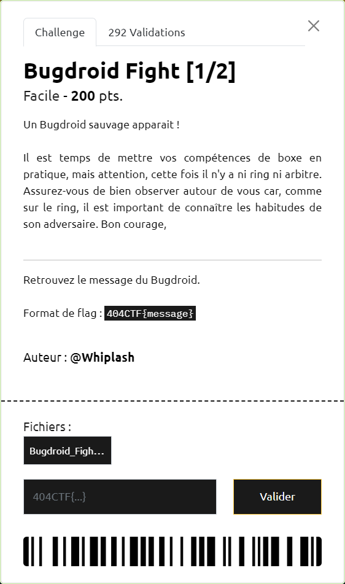
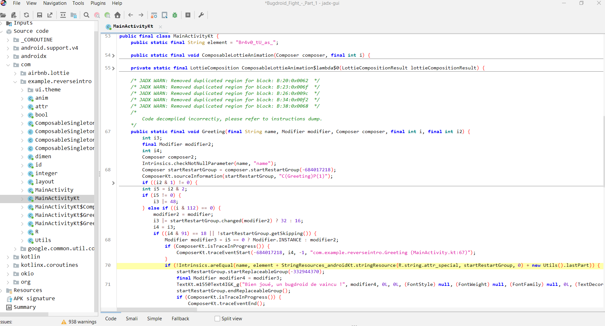
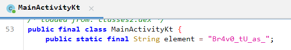
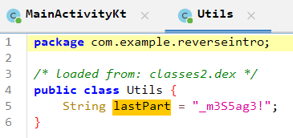
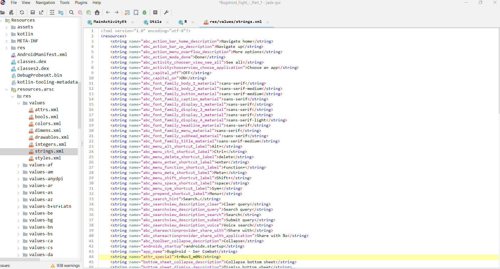

# Bugdroid Fight [1/2]

----

On ouvre directement l'APK fourni avec la GUI de JADX.

Un parcours rapide du code, montre que la victoire semble conditionnée par un test dans la méthode `MainActivityKt.Greeting` :

On s'intéresse alors au contenu de la chaine `element + StringResources_androidKt.stringResource(R.string.attr_special, startRestartGroup, 0) + new Utils().lastPart`

On trouve rapidement le début `Br4v0_tU_as_` :

Et la fin `_m3S5ag3!` :

Ne reste plus qu'à retrouver la partie intermédiaire correspondant à `R.string.attr_special`. Celle-ci est définie via les valeurs de ressources :

On a donc reconstitué le message `Br4v0_tU_as_tr0uv3_m0N_m3S5ag3!` permettant d'obtenir le flag `404CTF{Br4v0_tU_as_tr0uv3_m0N_m3S5ag3!}`
