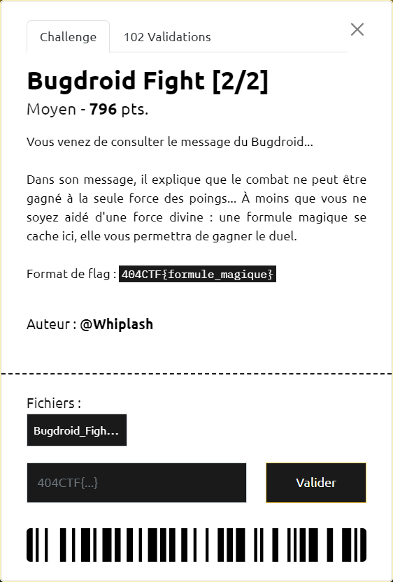
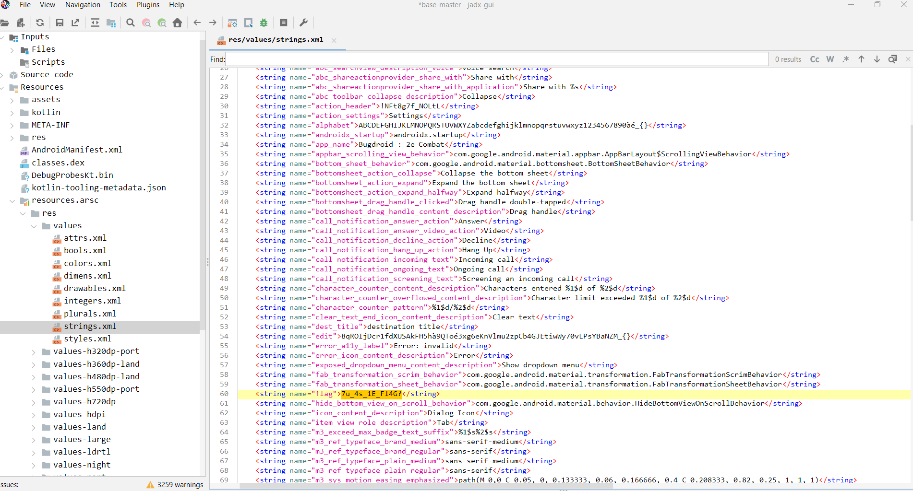
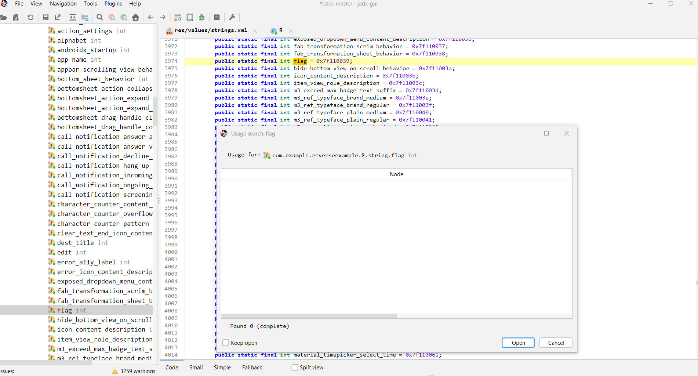
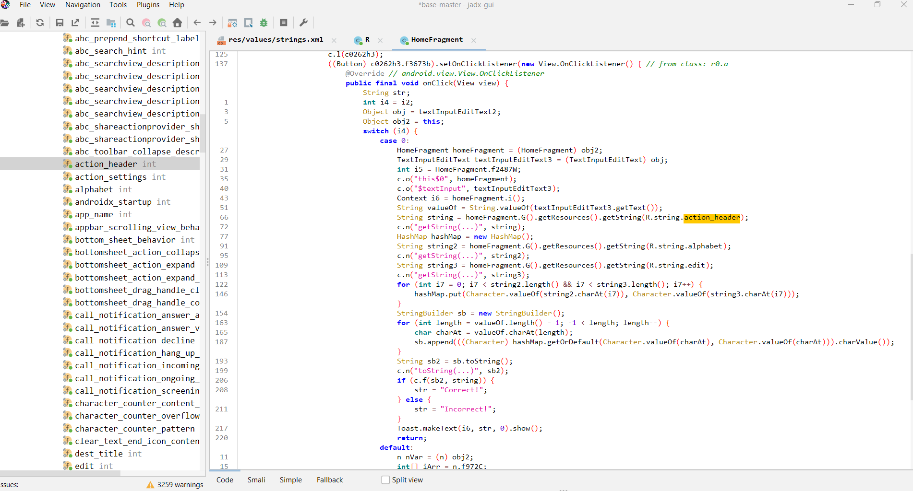

# Bugdroid Fight [2/2]



----

Cette fois-ci on dispose d'un fichier AAB, qui est une version "Bundleisée" d'un APK.

Pas de problème pour ouvrir ce type de fichier avec JADX.

Cependant on va au préalable convertir ce fichier AAB en APK, en utilisant l'outil [bundletool](https://github.com/google/bundletool) :

```sh
java -jar bundletool-all-1.16.0.jar build-apks --bundle=Bugdroid_Fight_-_Part_2.aab --output=Bug.apks
```

De l'archive APKS ainsi obtenue, on en extait uniquement le fichier `splits/base-master.apk`

Fort de l'expérience acquise lors du 1er challenge [Bugdroid Fight [1/2]](../bugdroid-fight-1_2/bugdroid-fight-1_2.md), on commence par parcourir le contenu du fichier `res/values/strings.xml`. On y trouve une chaine `flag` pour le moins suspecte :



Mais celle-ci n'est pas utilisée :



En parcourant à nouveau le fichier `res/values/strings.xml`, 3 autres chaines `alphabet`, `edit` et `action_header` ont des valeurs suspectes, qui elles sont utilisées dans `HomeFragment` :



On en déduit :
- qu'il faut faire en sorte que `sb2` soit égal à `string`
- que `string` est valorisé avec `action_header` (ie `!NFt8g7f_NOLtL`)
- qu'une correspondance entre 2 alphabets `string2` et `string3` a été réalisée pour encoder `string`.
- que `string2` est valorisé avec `alphabet` (ie `ABCDEFGHIJKLMNOPQRSTUVWXYZabcdefghijklmnopqrstuvwxyz1234567890àé_{}`)
- que `string3` est valorisé avec `edit` (ie `8qROIjDcr1fdXUSAkFH5hà9QToé3xg6eKnVlmu2zpCb4GJEtiwWy70vLPsYBaNZM_{}`)

On peut alors définir un code permettant de décoder `string` :

```java
import java.util.*;
public class MyClass {
    public static void main(String args[]) {
        String string = "!NFt8g7f_NOLtL";
        String string2 = "ABCDEFGHIJKLMNOPQRSTUVWXYZabcdefghijklmnopqrstuvwxyz1234567890àé_{}";
        String string3 = "8qROIjDcr1fdXUSAkFH5hà9QToé3xg6eKnVlmu2zpCb4GJEtiwWy70vLPsYBaNZM_{}";
        HashMap hashMap = new HashMap();
        for (int i7 = 0; i7 < string2.length() && i7 < string3.length(); i7++) {
           hashMap.put(Character.valueOf(string3.charAt(i7)), Character.valueOf(string2.charAt(i7)));
        }
        
        StringBuilder sb = new StringBuilder();
        for (int length = string.length() - 1; -1 < length; length--) {
            char charAt = string.charAt(length);
            sb.append(((Character) hashMap.getOrDefault(Character.valueOf(charAt), Character.valueOf(charAt))).charValue());
        }
        String sb2 = sb.toString();
        System.out.println(sb2);
    }
}
```

On retrouve ainsi la formule magique `4v4D0_K1dAvR0!` et donc le flag `404CTF{4v4D0_K1dAvR0!}`
