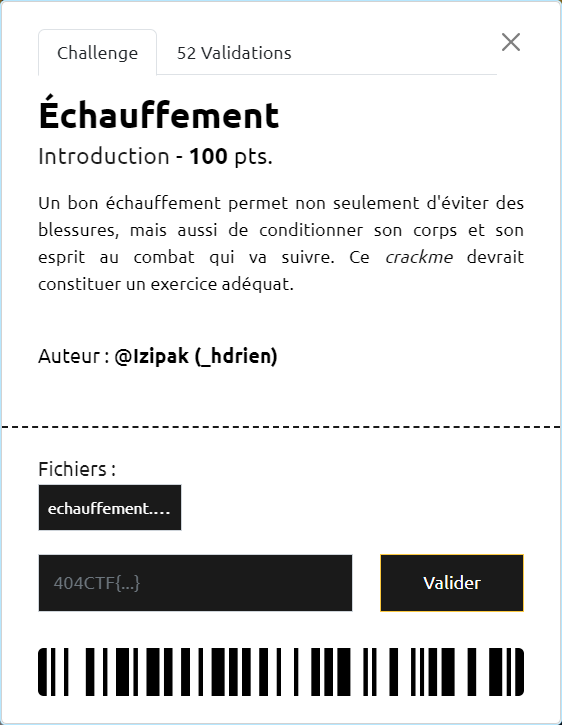

# Échauffement



----

Le fichier fourni est un binaire 64 bits :

```sh
$ file echauffement.bin
echauffement.bin: ELF 64-bit LSB pie executable, x86-64, version 1 (SYSV), dynamically linked, interpreter /lib64/ld-linux-x86-64.so.2, BuildID[sha1]=25249d3fcc57131140beb28b3c211d770f805818, for GNU/Linux 3.2.0, not stripped
```

On commence par le décompiler, par exemple avec Ghidra. On voit alors qu'il est constitué de 2 principales fonctions `main` et `secret_func_dont_look_here`.

La fonction `main` montre qu'on est invité à retrouver un mot de passe :
- d'au plus 64 (`0x40`) caractères 
- dont le retour de la fonction `secret_func_dont_look_here == 0`

```c
undefined8 main(void)
{
  int iVar1;
  char local_48 [64];
  
  puts("Vous ne devinerez jamais le mot de passe secret ! Mais allez-y, essayez..");
  fgets(local_48,0x40,stdin);
  iVar1 = secret_func_dont_look_here(local_48);
  if (iVar1 == 0) {
    puts(&DAT_001020c8);
  }
  else {
    puts("C\'est bien ce que je pensais, vous ne connaissez pas le mot de passe..");
  }
  return 0;
}
```

Dans la fonction `secret_func_dont_look_here` une boucle est réalisée pour effectuer une certaine comparaison, caractère par caractère, entre la chaine saisie et la chaine localisée en `&DAT_00102008` :

```c
undefined4 secret_func_dont_look_here(long param_1)
{
  size_t sVar1;
  undefined4 local_10;
  int local_c;
  
  sVar1 = strlen(&DAT_00102008);
  local_10 = 0;
  for (local_c = 0; local_c < (int)sVar1; local_c += 1) {
    if ((char)(*(char *)(param_1 + local_c) * '\x02' - (char)local_c) != (&DAT_00102008)[local_c])  {
      local_10 = 1;
    }
  }
  return local_10;
}
```

On peut réorganiser le test de comparaison afin d'avoir une version simplifiée plus lisible :

```c
(*(param_1[local_c])) * 2 != (&DAT_00102008)[local_c] + local_c
```

En conséquence, pour être valide :
- la chaine doit être de même longueur que `&DAT_00102008`
- pour chaque caractère, le double de son code ascii (`(*(param_1[local_c]))*2`) doit être égal à celui de `&DAT_00102008` auquel on a ajouté le numéro d'ordre dans la chaine (`local_c`)

Le script [`echauffement.py`](./echauffement.py) permet de retrouver cette chaine qui correspond au flag `404CTF{l_ech4uff3m3nt_3st_t3rm1ne}` :

```sh
$ python3 echauffement.py
404CTF{l_ech4uff3m3nt_3st_t3rm1ne}
```

On peut valider notre découverte en exécutant le binaire :

```sh
$ ./echauffement.bin
Vous ne devinerez jamais le mot de passe secret ! Mais allez-y, essayez..
404CTF{l_ech4uff3m3nt_3st_t3rm1ne}
Wow, impressionnant ! Vous avez réussi !
```
