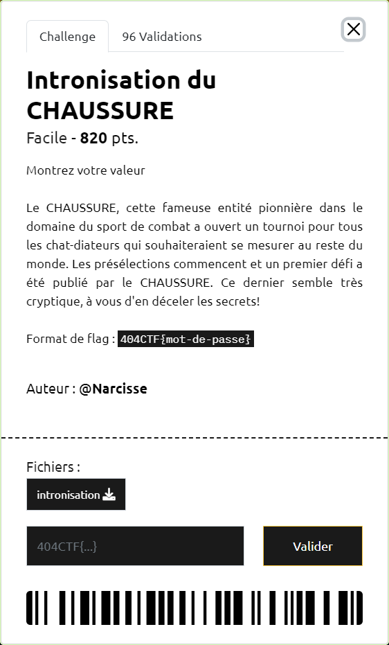

# Intronisation du CHAUSSURE



----

On dispose ici d'un fichier binaire 64 bits :

```sh
$ file intronisation
intronisation: ELF 64-bit LSB executable, x86-64, version 1 (SYSV), statically linked, not stripped
```

Suite à décompilation avec IDA Freware, on récupère les principales fonctions `start` et `strlen` :

```c
void __noreturn start()
{
  signed __int64 v0; // rax
  signed __int64 v1; // rax
  signed __int64 v2; // rax
  signed __int64 v3; // rax
  signed __int64 v4; // rax
  char v5[32]; // [rsp+0h] [rbp-20h] BYREF

  v0 = sys_write(1u, welcome, 0x50uLL);
  v1 = sys_read(0, v5, 0x20uLL);
  if ( strlen(v5) == 14
    && v5[1] == 116
    && v5[7] == 114
    && v5[10] == 49
    && v5[11] == 115
    && v5[5] == 110
    && v5[4] == 49
    && v5[2] == 117
    && v5[0] == 53
    && v5[9] == 110
    && v5[12] == 51
    && v5[8] == 48
    && v5[3] == 112
    && v5[6] == 116 )
  {
    v3 = sys_write(1u, won, 0xBuLL);
  }
  else
  {
    v2 = sys_write(1u, lost, 0x15uLL);
  }
  v4 = sys_exit(0);
}


size_t strlen(const char *s)
{
  size_t v1; // rcx

  v1 = 0LL;
  while ( *s )
  {
    ++v1;
    ++s;
  }
  return v1;
}
```

Pour retrouver le mot de passe `5tup1ntr0n1s3`, il suffit de reconstituer la chaine `v5`, manuellement ou à l'aide d'un script ([`intronisation.py`](./intronisation.py)) :

```sh
$ python3 intronisation.py
message='5tup1ntr0n1s3'
```

On peut valider notre découverte en exécutant le binaire :

```sh
$ ./intronisation
Bienvenue, rétro-ingénieur en herbe!
Montre moi que tu es à la hauteur :
>>> 5tup1ntr0n1s3
Bravo !!!
```

Le flag est donc `404CTF{5tup1ntr0n1s3}`
