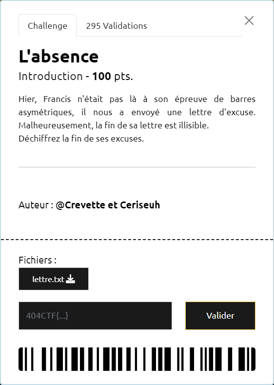

# L'absence



----

Le contenu du fichier [`lettre.txt`](./lettre.txt) donne quelques indices :
- l'auteur de la lettre, francis vigenere, évoque le [Chiffre de Vigenère](https://fr.wikipedia.org/wiki/Chiffre_de_Vigen%C3%A8re)
- sur la partie lisible, les majuscules sont mal placées.
- si on prend ces majuscules dans l'ordre, cela forme le mot `GYMNASTIQUES`

En appliquant le décodage du chiffrement de Vigenère avec la clé `GYMNASTIQUES`, la partie chiffrée devient lisible et fait apparaître le flag `404CTF{NeVolezPasLesDrapeauxSvp}` :

```txt
En effet, j'ai du m'absenter car le drapeau de ma nation a ete dissimule par des gens qui voulaient faire perdre mon pays ! Mais apres une longue recherche, j'ai enfin pu le retrouver. Le voici : 404CTF{NeVolezPasLesDrapeauxSvp}
```

NB : [CyberChef](https://gchq.github.io/CyberChef/#recipe=Vigen%C3%A8re_Decode('')) propose ce type de décodage
