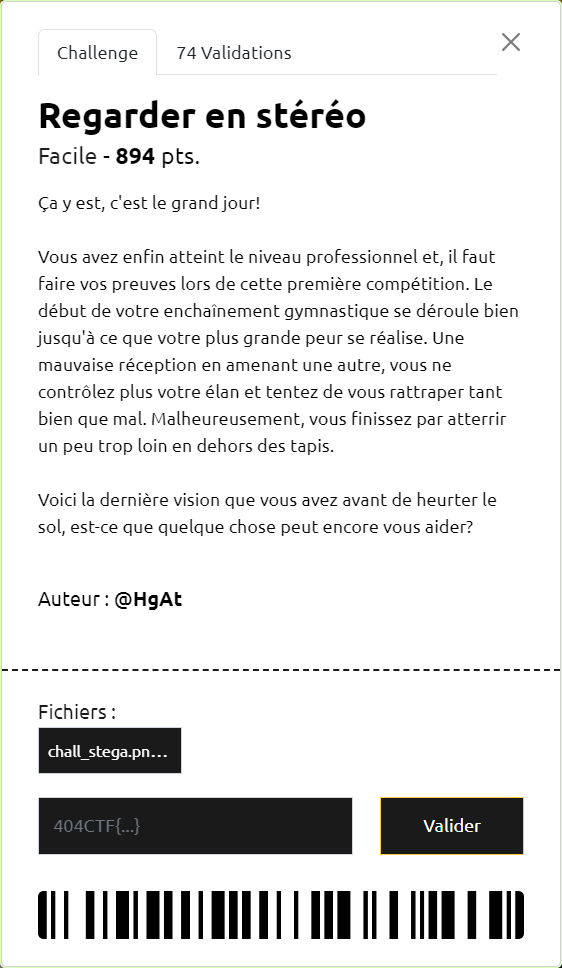
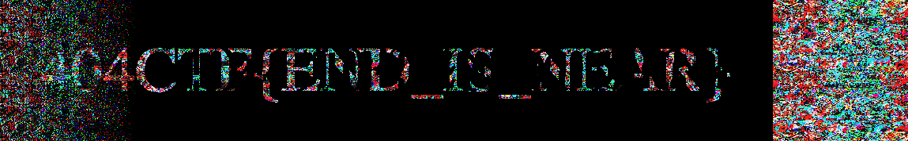
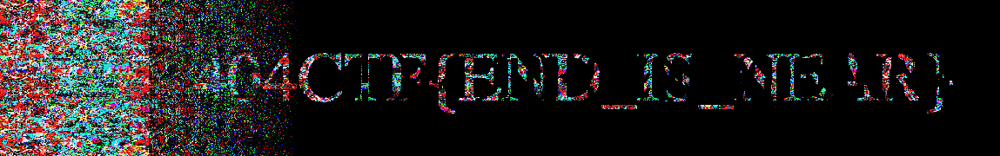

# Regarder en stéréo

----

L'image et le titre du challenge font écho aux stéréogrammes.

Après avoir tenté en vain de voir quelque chose apparaître en accomandant à l'infini, changement d'approche.

On ouvre l'image avec StegSolve, et on y utilise le Stereogram Solver.

Aux offsets 171 et 978 on voit apparaître le flag `404CTF{END_IS_NEAR}` :

