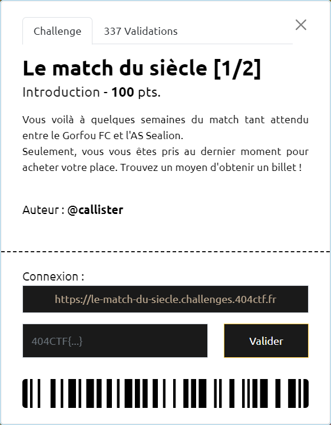
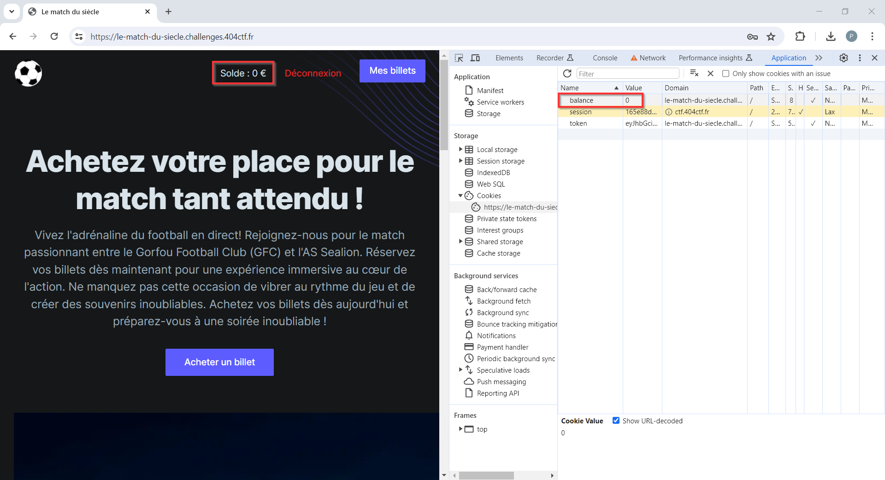
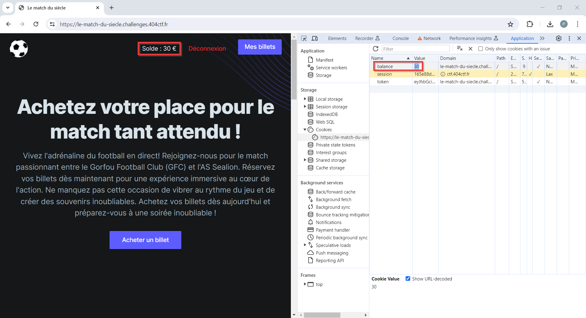
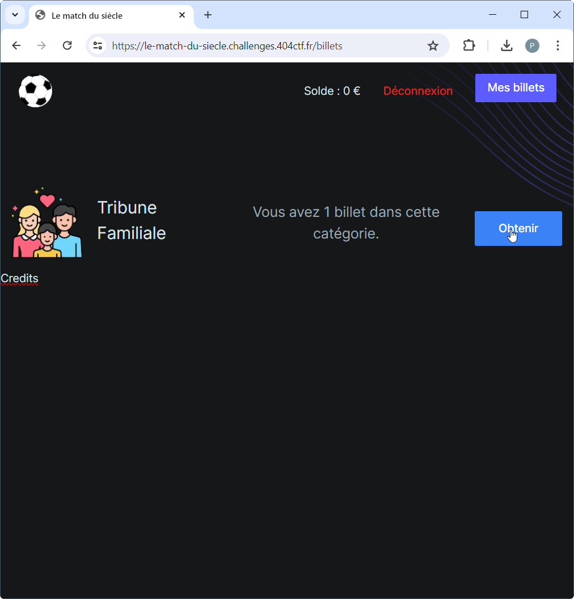

# Le match du siècle [1/2]

----

On commence par se rendre sur le site indiqué https://le-match-du-siecle.challenges.404ctf.fr/

Après avoir créé un compte, on se connecte avec.

Le compte dont on dispose alors a un solde de 0€, ne permettant donc pas d'acheter le moindre billet.

Parmi les cookies positionnés suite à la connexion, on remarque la présence d'un cookie `balance=0` :

Une modification de la valeur de ce cookie (par exemple `30`) et un rafraichissement de la page, indique maintenant un solde différent (ici `30€`)

Il est alors possible d'acheter un billet (ici "Tribune Familiale")

Le menu "Mes billets" permet de consulter la liste des billets et de les récupérer :

Le billet ainsi téléchargé contient le flag `404CTF{b5a77ed0fa6968b21df7fb137437fae1}` :

