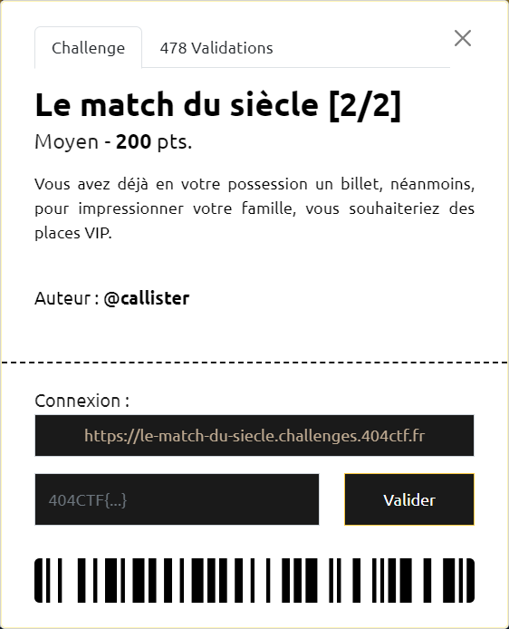
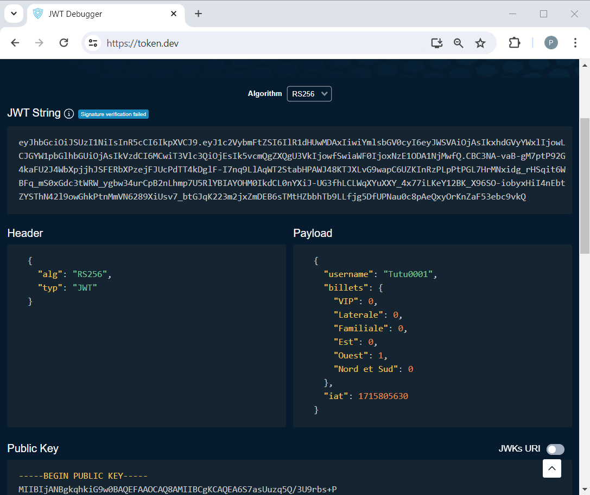
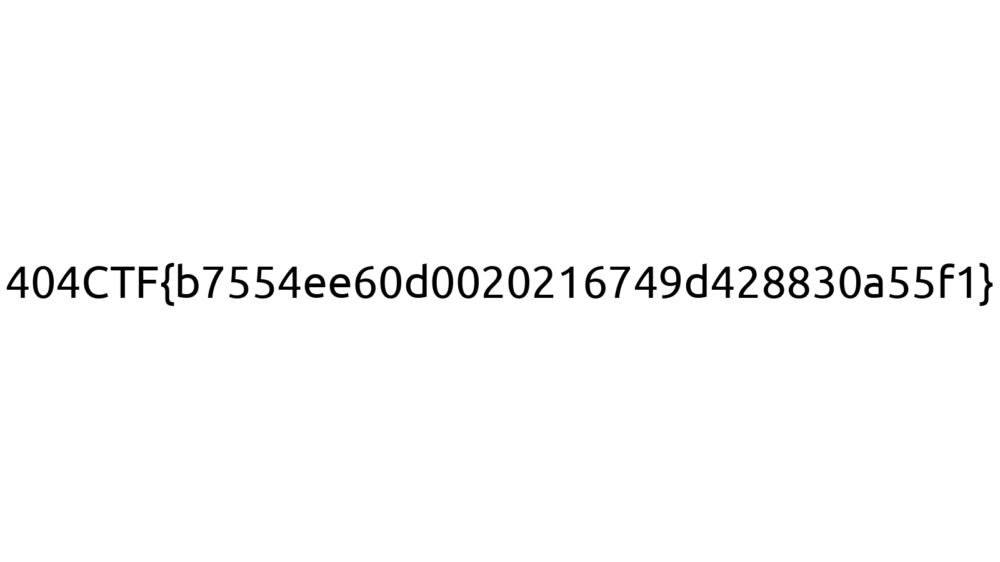

# Le match du siècle [2/2]



----

On est sur le même site que celui de la 1ère étape [Le match du siècle [1/2]](../le-match-du-siecle-1_2/le-match-du-siecle-1_2.md)

Parmi les cookies, il y a aussi un cookie `token` au format JWT.

Une analyse de celui-ci (par exemple sur [token.dev](https://token.dev/)), montre notamment la liste des billets dont on dispose, ici après avoir acheté un billet en tribune "Ouest" :



Une attaque classique sur un token JWT consiste à modifier la partie payload et à indiquer dans la partie header que l'algorithme de signature est `None`.

Ici, cela ne fonctionne pas, et un message nous indique qu'on a essayer de hacker le système.

Il faut donc trouver une autre approche pour obtenir un ticket VIP.

En analysant ce qui se passe lors du téléchargement d'un billet, on découvre l'appel suivant :

```http
POST /api/riche
Content-Type: application/json
Cookie: token=....; balance=0

{"token":"Ouest"}
```

L'idée vient alors d'effectuer le même type d'appel, mais en remplaçant "Ouest" par "VIP" :

```http
POST /api/riche
Content-Type: application/json
Cookie: token=....; balance=0

{"token":"VIP"}
```

Pour forger cet appel, n'importe quel outil peut convenir (cURL, plugin rest-client dans vscodium, ...)

On obtient alors un billet "VIP" contenant le flag `404CTF{b7554ee60d0020216749d428830a55f1}` :


