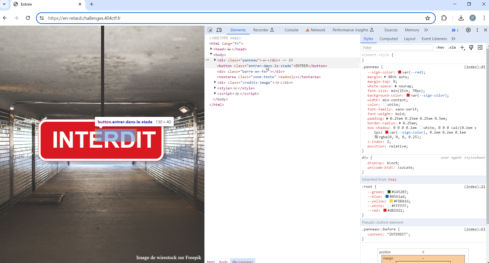
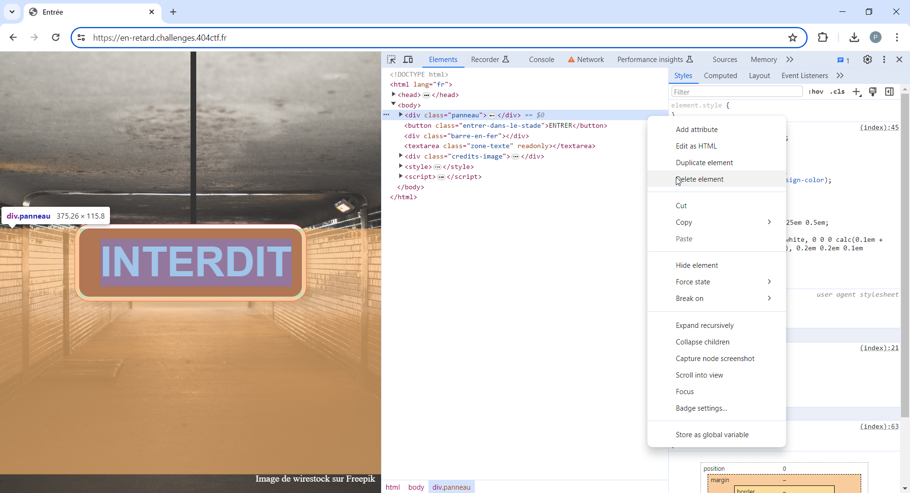
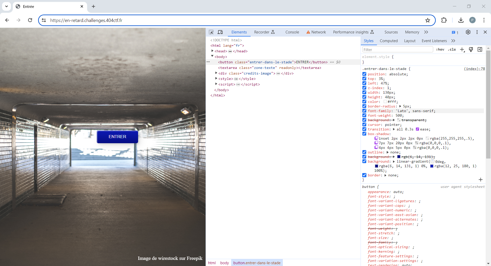
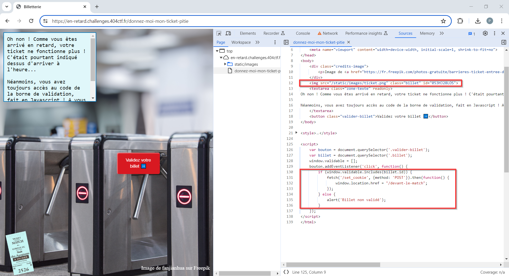
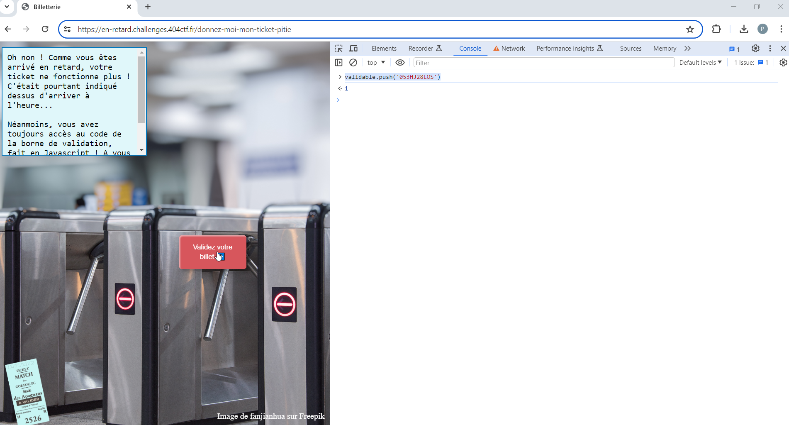
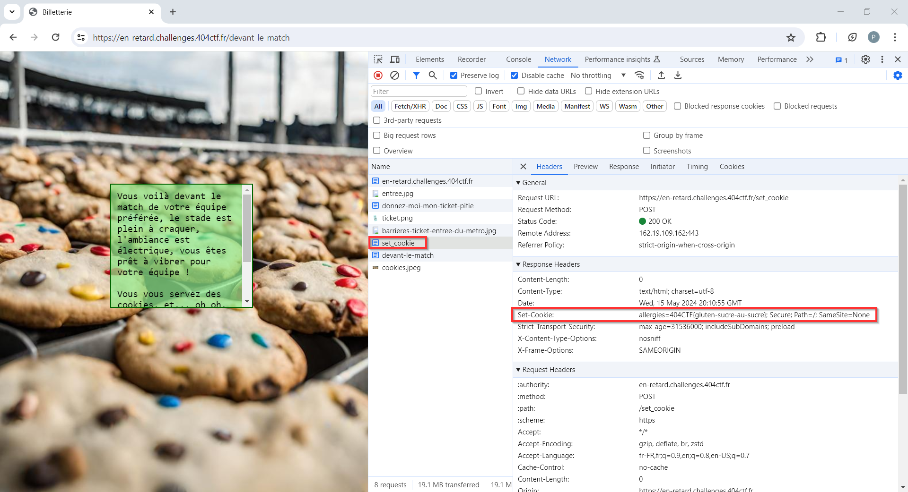

# Vous êtes en RETARD

----

On commence par se rendre sur le site indiqué : https://en-retard.challenges.404ctf.fr/, et à explorer le code HTML de la page.

On y découvre la présence d'un bouton "ENTRER" masqué par le panneau "INTERDIT" mis devant :

On peut supprimer ce panneau "INTERDIT" du DOM :

Une fois l'opération réalisée, le bouton "ENTRER" est visible et devient accessible :

En cliquant sur celui-ci, on est redirigé vers la page https://en-retard.challenges.404ctf.fr/donnez-moi-mon-ticket-pitie

Comme suggéré, on explore le code Source de la page.

On y découvre : 
- la fonction déclenchée au click sur le bouton "Validez votre billet ➡️"
- l'identifiant que doit avoir le ticket (`billet.id`) pour être valide : `053HJ28LOS`

Via la console, on ajoute donc ce ticket à la liste des billets à valider `validable` :

Suite à validation, on est redirigé vers la page https://en-retard.challenges.404ctf.fr/devant-le-match.

Un cookie `allergies` contenant le flag `404CTF{gluten-sucre-au-sucre}` a été positionné lors de l'appel à `/set_cookie` (URL mentionnée dans la fonction JS si la ticket était valide) :

